# ResNet-50 training from scratch on ImageNet1k (OneCycleLR + AMP) using AWS

This is a PyTorch implementation of training a ResNet-50 model **from scratch** on the **ImageNet-1k** dataset on an AWS EC2 instance, as part of *The School of AI – ERA-V4* course.

This repository trains ResNet-50 from scratch on **ImageNet-Mini** (for pipeline validation) and on **full ImageNet-1k**, using **OneCycleLR** and mixed precision (**AMP**):
- **Local**: single GPU (RTX 4060 Ti, 16 GB)
- **AWS**: spot instance **g5.xlarge** (NVIDIA A10G 24 GB)

Outputs include **TensorBoard** logs (local), **Weights & Biases** (AWS), plus structured **CSV** and **Markdown** training logs, model summary, and classification report.

---

## 1) Overview

**Task**  
- Dataset: **ImageNet-1k** (~1.28M train, 50k val, **1000** classes).  
- Train/val folder layout is standard `train/` and `val/` class-folders.

**Backbone**  
- **ResNet-50** from scratch (no pretrained weights).

**Optimization / Policy**  
- Optimizer: **SGD** (momentum, weight decay)  
- Schedule: **OneCycleLR** (per-batch) with `--max-lr` determined via LR-Finder  
- **Label smoothing**  
- Precision: **AMP** (fp16 autocast + GradScaler)

**Devices**  
- **Local**: RTX 4060 Ti (16 GB VRAM)  
- **AWS**: g5.xlarge (4 vCPU, 16 GiB RAM) with **NVIDIA A10G 24 GB**

**Monitoring**  
- **Local**: TensorBoard + CSV/Markdown logs  
- **AWS**: W&B (`imagenet1k_runs`) + CSV/Markdown logs

**Checkpoints (paths you can reuse)**
- **Local**  
  - `checkpoints\r50_imagenet1k_onecycle_amp_bs64_ep150\best.pth` → best validation (deploy/HF)  
  - `checkpoints\r50_imagenet1k_onecycle_amp_bs64_ep150\checkpoint.pth` → resume  
- **AWS**  
  - `/mnt/imagenet1k/checkpoints/imagenet1kfull_g5x_1gpu_dali_nvme_lr0p125_bs256_e150_work6/last_epoch.pth` → resume  
  - `/mnt/imagenet1k/checkpoints/imagenet1kfull_g5x_1gpu_dali_nvme_lr0p125_bs256_e150_work6/best_acc_epoch141.pth` → best validation (deploy/HF)

**TensorBoard (local)**  
```bash
tensorboard --logdir runs
```
Shows `train/loss`, `train/lr`, `train/top1`, etc., live.

**W&B (AWS)**  
- Project: `imagenet1k_runs`  
- Run name: `imagenet1kfull_g5x_1gpu_dali_nvme_lr0p125_bs256_e150_work6` (example)

> **Auto-filled results (from `out/<RUN>/train_log.csv`):**  
> Best Val Top-1: **77.82%** • Best Val Top-5: **93.82%** • Best Epoch: **228**

---

## 2) Quickstart

### 2.1 Clone & setup environment

```bash
git clone https://github.com/Sagar063/week9_ERAV4_ImageNet_ResNet-50_Model_Experiments.git
cd week9_ERAV4_ImageNet_ResNet-50_Model_Experiments
```

**Local (Windows)**
```powershell
python -m venv .venv
.\.venv\Scripts\Activate.ps1
pip install -r .
equirements.txt
```

**AWS**
1) **Mount your ImageNet EBS volume at `/mnt/imagenet1k`**
```bash
# See disks
lsblk -f

# Create mountpoint (idempotent)
sudo mkdir -p /mnt/imagenet1k

# Mount your 400-GB EBS volume (replace if your data disk isn't /dev/nvme1n1)
sudo mount -o defaults,noatime /dev/nvme1n1 /mnt/imagenet1k

# Give yourself ownership
sudo chown -R ubuntu:ubuntu /mnt/imagenet1k

# Verify
df -h /mnt/imagenet1k && ls -lah /mnt/imagenet1k
```

2) **(Ephemeral) NVMe workspace + virtual environment**
```bash
# The DLAMI ephemeral NVMe is typically at /opt/dlami/nvme
df -h /opt/dlami/nvme || sudo mkdir -p /opt/dlami/nvme

# Make a fresh venv (idempotent)
sudo mkdir -p /opt/dlami/nvme/envs
sudo chown -R ubuntu:ubuntu /opt/dlami/nvme
python3 -m venv /opt/dlami/nvme/envs/imagenet1k_venv

# Activate and install deps from your repo
source /opt/dlami/nvme/envs/imagenet1k_venv/bin/activate
cd ~/week9_ERAV4_ImageNet_ResNet-50_Model_Experiments
pip install --upgrade pip
pip install -r requirements_aws.txt
```

### 2.2 Train from scratch

#### ImageNet-1k :  download for training in local machine
  - Size: **156 GB**
  - Source 1: https://www.kaggle.com/c/imagenet-object-localization-challenge/
    - Download via Kaggle CLI:
    ```bash
    kaggle competitions download -c imagenet-object-localization-challenge
    ```
**For dataset download in AWS and AWS setup, see the [ImageNet Dataset Setup on AWS instructions](./README_AWS.md).**

#### Once the dataset is downloaded place as:
```
data/imagenet/
  ├─ train/
  └─ val/
  └─ test/
```

**Run LR-Finder (recommended)**
```bash
python lr_finder.py find_lr --num_iter 100 --end_lr 1.0 --batch_size 64
```

**Run training (Local)**
```bash
python train_full_ImageNet1k_SingleGPU.py --data-root data/imagenet  --batch-size 64 --epochs 150 --max-lr 0.0125  --pct-start 0.1 --workers 8 --reports --use-best-for-reports --name r50_imagenet1k_onecycle_amp_bs64_ep150
```

**Run training (AWS)**
```bash
tmux new -s imagenet1k_full -n train

# Inside tmux
source /opt/dlami/nvme/envs/imagenet1k_venv/bin/activate
cd ~/week9_ERAV4_ImageNet_ResNet-50_Model_Experiments

# (Optional) start W&B session automatically when resuming
unset RESET_SCHED
unset FREEZE_LR
unset FREEZE_LR_VALUE

bash scripts/launch_single_gpu.sh /mnt/imagenet1k 150 256 6 \
  --max-lr 0.125 \
  --stats-file data_stats/imagenet_1k_aws_stats.json \
  --show-progress --amp --channels-last \
  --out-dir imagenet1kfull_g5x_1gpu_dali_nvme_lr0p125_bs256_e150_work6 \
  --wandb --wandb-project imagenet1k_runs \
  --wandb-tags imagenet1k_full,dali,1gpu,nvme,lr0p125,bs256,e150,work6
```

### 2.3 Resume from checkpoint

**Local**
```bash
python train_full_ImageNet1k_SingleGPU.py   --data-root data/imagenet   --batch-size 64   --epochs 235   --max-lr 0.0125   --pct-start 0.1   --workers 8   --reports   --use-best-for-reports   --name r50_imagenet1k_onecycle_amp_bs64_ep150   --resume
```


**AWS** Refer README_AWS.md for more instructions
```bash
tmux new -s imagenet1k_full -n train # tmux attach -t imagenet1k_full  if tmux is running

# Inside tmux
source /opt/dlami/nvme/envs/imagenet1k_venv/bin/activate
cd ~/week9_ERAV4_ImageNet_ResNet-50_Model_Experiments

# (Optional) start W&B session automatically when resuming
unset RESET_SCHED
unset FREEZE_LR
unset FREEZE_LR_VALUE

bash scripts/launch_single_gpu.sh /mnt/imagenet1k 160 256 6 \
  --max-lr 0.125 \ # Put value we got by executing lr_finder.py
  --stats-file data_stats/imagenet_1k_aws_stats.json \
  --show-progress \
  --amp --channels-last \
  --resume /mnt/imagenet1k/checkpoints/imagenet1kfull_g5x_1gpu_dali_nvme_lr0p125_bs256_e150_work6/last_epoch119.pth \
  --out-dir imagenet1kfull_g5x_1gpu_dali_nvme_lr0p125_bs256_e150_work6 \
  --wandb --wandb-project imagenet1k_runs \
  --wandb-tags imagenet1k_full,dali,1gpu,onecycle_reset,bs256,ep120to160,resumed_e120
```
**For more details on diffrent resume approaches, see the [Resuming trainings on AWS instructions](./README_AWS.md).**

### 2.4 Key arguments
#### For training in local machine
| Arg | Default | Meaning |
|---|---:|---|
| `--data-root` | `data/imagenet` | Root containing `train/` and `val/` (ImageFolder) | --> dataset path for training train_full_ImageNet1k_SingleGPU.py
| `--name` | `r50_imagenet1k_onecycle_amp_bs64_ep150` | Run/experiment name used for all output folders |
| `--epochs` | `20` | Number of epochs |
| `--batch-size` | `64` | Global batch size (single-GPU) |
| `--workers` | `8` | DataLoader workers |
| `--img-size` | `224` | Input image size |
| `--max-lr` | `None` | Peak LR (if None, uses linear scaling rule `0.1 * (batch/256)`) |
| `--pct-start` | `0.3` | Fraction of steps for LR warm-up (OneCycleLR) |
| `--div-factor` | `25.0` | Initial LR = `max_lr/div_factor` |
| `--final-div-factor` | `1e4` | Final LR = `max_lr/final_div_factor` |
| `--no-amp` | `False` | Disable AMP if set |
| `--use-class-style-aug` | `False` | Alternate augmentation style |
| `--resume` | `False` | Resume from `checkpoints/<name>/checkpoint.pth` |
| `--reports` | `False` | Generate classification report & save curves |

#### For training in AWS machine

| Arg | Default | Meaning |
|---|---:|---|
| `--data` | **required** | Root that contains `train/` and `val/` (ImageFolder) |
| `--out-dir` | `./` | Run name (used to create `/mnt/imagenet1k/{out,runs,reports,checkpoints}/<out-dir>`) |
| `--epochs` | `90` | Total epochs (used to align/extend scheduler) |
| `--batch-size` | `256` | **Per-GPU** batch size (global = `batch × world_size`) |
| `--eval-batch-size` | `256` | Validation batch size |
| `--workers` | `min(8, cpu_count)` | DataLoader workers |
| `--crop-size` | `224` | Input crop size |
| `--loader` | `dali` | `dali` (fast) or `albumentations` (PyTorch DataLoader path) |
| `--stats-file` | `None` | JSON with mean/std (used by Albumentations). Example: `data_stats/imagenet_1k_aws_stats.json` |
| `--stats-samples` | `50000` | Samples to compute mean/std (albumentations path only) |
| `--use-class-style` | `False` | Enable class-style augmentation (albumentations only) |
| `--amp` | off by default | Enable Automatic Mixed Precision |
| `--channels-last` | off by default | Use NHWC memory format |
| `--resume` | `''` | Path to checkpoint (`.../last_epochXYZ.pth` or `best_acc_epochXYZ.pth`) |
| `--num-classes` | `1000` | Number of classes |
| `--pretrained` | off | Start from torchvision weights (for finetune experiments) |
| `--seed` | `42` | Seed (with cudnn.benchmark = True) |
| `--use-tb` | off | TensorBoard logging → `runs/<out-dir>` |
| `--show-progress` | off | Show per-batch `tqdm` bars (rank-0 only) |
| `--do-report` | off | Save `classification_report.txt` and `confusion_matrix.csv` |
| `--max-lr` | `None` | Peak LR (if None → linear scaling `0.1 × (global_bsz / 256)`) |
| `--pct-start` | `0.3` | OneCycle warm-up fraction |
| `--div-factor` | `25.0` | OneCycle initial LR = `max_lr / div_factor` |
| `--final-div-factor` | `1e4` | OneCycle final LR = `max_lr / final_div_factor` |
| `--wandb` | off | Enable Weights & Biases |
| `--wandb-project` | `imagenet1k_runs` | W&B project name |
| `--wandb-entity` | `None` | W&B entity/org (optional) |
| `--wandb-tags` | `''` | Comma-separated tags |
| `--wandb-offline` | off | Log offline and sync later |

---

Environment Variables (affect resume/freeze behavior)

| Env Var | Effect | When to Use |
|---|---|---|
| `RESET_SCHED=1` | Rebuilds and realigns scheduler when resuming with a different `--epochs`. | Extend or shrink total epochs on resume. |
| `FREEZE_LR=1` | Replaces scheduler with constant-LR scheduler. | Keep LR fixed for entire (resumed) run. |
| `FREEZE_LR_VALUE=<float>` | Explicit LR value if freezing. | Optional override; else uses last used LR. |

---

Example Combinations

| Scenario | Command / Env Vars | Result |
|---|---|---|
| **Fresh run with fixed LR** | `FREEZE_LR=1`, no resume | Constant LR entire run |
| **Resume normally** | (no env vars) | Scheduler continues smoothly |
| **Resume + extend epochs** | `export RESET_SCHED=1` | Scheduler realigned, OneCycle continues |
| **Resume + freeze LR** | `export FREEZE_LR=1` | LR frozen to last used value |
| **Resume + extend + freeze** | `export RESET_SCHED=1; export FREEZE_LR=1` | Scheduler rebuilt then frozen immediately |


### 2.5 Repository layout
```
week9_ERAV4_ImageNet_ResNet-50_Model_Experiments/
├─ train.py # Train script for ImageNet-Mini (subset) experiments
├─ train_full_ImageNet1k_SingleGPU.py # Train full ImageNet-1k on local machine (single GPU)
├─ train_full_ImageNet_AWS.py # Train full ImageNet-1k on AWS (DALI, mixed precision)
├─ model.py # ResNet-50 architecture definition
├─ lr_finder.py # Learning-rate finder (plots LR vs loss)
│
├─ dataset/
│ ├─ imagenet.py # TorchVision-style ImageNet loader (for albumentations)
│ ├─ imagenet_dali.py # NVIDIA DALI-based high-performance ImageNet loader
│ └─ imagenet_mini.py # Lightweight ImageNet-Mini loader for debugging
│
├─ data/ # Training data (local mini version)
├─ data_stats/
│ └─ imagenet_1k_aws_stats.json # Cached channel mean/std stats used for normalization
│
├─ lr_finder_plots/
│ ├─ lr_finder_plots_imagenette/ # LR finder results for Imagenette
│ └─ lr_finder_plots_imagenet1k_AWS/ # LR finder results for AWS DALI pipeline
│
├─ checkpoints/
│ ├─ imagenet1kfull_g5x_1gpu_dali_nvme_lr0p125_bs256_e150_work6/ # AWS (full ImageNet) runs
│ │ ├─ best_acc_epochXXX.pth
│ │ ├─ last_epochXXX.pth
│ │ └─ last_epoch.pth
│ ├─ r50_imagenet1k_onecycle_amp_bs64_ep150/ # Local full ImageNet run
│ │ ├─ best.pth
│ │ └─ checkpoint.pth
│ └─ r50_onecycle_amp/ # Imagenet-Mini baseline
│ └─ best.pth
│
├─ out/
│ ├─ imagenet1kfull_g5x_1gpu_dali_nvme_lr0p125_bs256_e150_work6/ # AWS training logs
│ │ ├─ train_log.csv
│ │ ├─ logs.md
│ │ └─ metrics.csv (optional)
│ ├─ r50_imagenet1k_onecycle_amp_bs64_ep150/ # Local full ImageNet logs
│ │ ├─ train_log.csv
│ │ └─ logs.md
│ └─ r50_onecycle_amp/ # Imagenet-Mini logs
│ ├─ train_log.csv
│ └─ logs.md
│
├─ reports/
│ ├─ imagenet1kfull_g5x_1gpu_dali_nvme_lr0p125_bs256_e150_work6/ # AWS training reports
│ │ ├─ accuracy_curve.png
│ │ ├─ loss_curve.png
│ │ ├─ classification_report.txt
│ │ ├─ confusion_matrix.csv
│ │ └─ model_summary.txt
│ ├─ r50_imagenet1k_onecycle_amp_bs64_ep150/ # Local full ImageNet reports
│ │ ├─ accuracy_curve.png
│ │ ├─ loss_curve.png
│ │ ├─ classification_report.txt
│ │ ├─ confusion_matrix.csv
│ │ └─ model_summary.txt
│ └─ r50_onecycle_amp/ # Imagenet-Mini reports
│ ├─ accuracy_curve.png
│ ├─ loss_curve.png
│ ├─ classification_report.txt
│ ├─ confusion_matrix.csv
│ └─ model_summary.txt
│
├─ runs/
│ ├─ imagenet1kfull_g5x_1gpu_dali_nvme_lr0p125_bs256_e150_work6/ # AWS TensorBoard runs
│ ├─ r50_imagenet1k_onecycle_amp_bs64_ep150/ # Local TensorBoard logs
│ └─ r50_onecycle_amp/ # Imagenet-Mini TensorBoard logs
│
├─ images/
│ ├─ resnet50_arch.png # Model architecture visualization
│ └─ imagenet_samples.png # Sample input images
│
├─ scripts/ # Bash utilities (launch, resume, etc.)
│ └─ fix_imagenet_val.py
│ └─ launch_lr_finder.sh
│ └─ launch_single_gpu.sh
│ └─ launch_multi_gpu.sh
│ └─ make_debug_data.py
│ └─ rehumanize_imagenet_reports.py   # To change classification report and confusion matrix from class ID to Class names
│
├─ utils/
│ └─ imagenet_class_index.json # Synset → human-readable name mapping
│
├─ update_readme.py # Auto-update README metadata and results tables
├─ requirements.txt # Local dependencies
├─ requirements.aws.txt # AWS dependencies (DALI, etc.)
├─ README.md # Project overview and results summary
├─ README_AWS.md # AWS Setup instructions
└─ .gitignore / .gitattributes # Git configuration
```

---

## 3. About ImageNet

**ImageNet** is one of the most influential datasets in computer vision research.  
It contains over **14 million labeled images** organized into more than **22,000 categories**, and has become the foundation for evaluating and benchmarking deep neural networks for image classification and object recognition.

For this iteration, we use **ImageNet-Mini**, a curated **1,000-class subset (~4 GB)** derived from the ImageNet-1K dataset.  
It maintains the same structure and class diversity but is dramatically smaller, making it ideal for **rapid experimentation**, **debugging pipelines**, and **prototyping architectures** locally before scaling to full ImageNet-1K.

**Key Highlights:**
- 📚 **Standard Benchmark:** Widely used for assessing model accuracy and robustness.  
- ⚙️ **Lightweight & Scalable:** Enables faster iteration on consumer GPUs.  
- 🎯 **Diverse Classes:** Includes animals, vehicles, natural scenes, and household objects.  
- 🧩 **Transfer Learning Hub:** Models pretrained on ImageNet form the backbone of countless computer-vision systems.

### Sample Classes and Images

  
*ImageNet-Mini sample classes and images.*

---

## 4. About ResNet-50

**ResNet-50** (He et al., 2015) is a deep convolutional neural network consisting of **50 layers** built on the concept of *residual learning*.  
Residual connections (skip connections) allow gradients to flow more effectively through very deep networks, mitigating the **vanishing-gradient problem** and enabling the successful training of extremely deep CNNs.

**Key Features:**
- 🧩 **Residual Blocks:** Learn identity mappings that help deeper networks converge faster.  
- ⚙️ **Bottleneck Design:** Uses 1×1, 3×3, and 1×1 convolutions to balance accuracy and computation.  
- 🧠 **Depth:** 48 convolutional + 1 max-pool + 1 average-pool + 1 fully-connected layer (≈ 25.6 M parameters).  
- 🎯 **Input:** 224 × 224 × 3 images  **Output:** 1000 classes (ImageNet-1K).  
- 🚀 **Impact:** ResNet architectures revolutionized deep learning and remain a standard backbone for modern vision models.

### Architecture Diagram

  
*Residual Networks (ResNet-50) architecture.*

---

## 5) Learning Rate Finder (LR-Finder)

Before starting full training, we run a **Learning Rate Finder** to determine an optimal `--max-lr` for OneCycleLR. This reduces guesswork and stabilizes convergence.

**Why LR-Finder**
- 🚀 Eliminates guesswork (finds a good LR range)
- ⚖️ Improves efficiency (avoid suboptimal LRs)
- 📈 Optimizes OneCycleLR (use the discovered LR as `max_lr`)
- 💡 Reproducible (curve can be regenerated anytime)

**How it works**  
`lr_finder.py` performs a range test (`start_lr → end_lr` over N iterations), recording loss vs LR and saving a plot to `lr_finder_plots/`.

**🧮 How to Decide --num_iter Based on Batch Size**

When running the Learning Rate Finder, each batch = one iteration.
For a dataset with N samples and batch size B:

iterations per epoch = 𝑁/𝐵
But we don’t need a full epoch to see the LR vs. loss pattern —
only about 1/10th of an epoch, capped at ~1000 iterations.

So the rule of thumb is:

✅ Run at most one full epoch worth of iterations, but never more than 1000.

| Dataset       | #Samples | Batch Size | 1 Epoch ≈ (iters) | Recommended `--num_iter` |
| ------------- | -------- | ---------- | ----------------- | ------------------------ |
| CIFAR-10      | 50 000   | 128        | 390               | 300 – 400                |
| ImageNet-Mini | 100 000  | 128        | 780               | 700 – 800                |
| ImageNet-1k   | 1.28 M   | 64         | 20 000            | 800 – 1000  (cap)        |
| ImageNet-1k   | 1.28 M   | 128        | 10 000            | 800 – 1000               |
| ImageNet-1k   | 1.28 M   | 256        | 5 000             | 500 – 800                |
| ImageNet-1k   | 1.28 M   | 512        | 2 500             | 300 – 500                |

**Run (Local)**
```bash
python lr_finder.py find_lr --data-root data/imagenet --batch-size 64 --num-iter 1000
```

**Run (AWS)**
```bash
bash scripts/launch_lr_finder.sh /mnt/imagenet1k 256 2000 lr_finder_plots_imagenet1k_AWS
```
**🎯 How to Pick the Final max_lr for Training**

If you’re using OneCycleLR, the max_lr is the peak learning rate during training.
You can estimate it either from the LR Finder or by scaling with batch size.

🔹 Option 1: Use LR Finder Result

Pick the LR value just before the loss starts to blow up (the lowest point before the spike).

🔹 Option 2: Scale Linearly with Batch Size

Use the linear scaling rule (starting from baseline 0.1 for batch = 256):

max_lr = 0.1 × batch size/256

| Batch Size | Scaled `max_lr` | Comment                              |
| ---------- | --------------- | ------------------------------------ |
| 64         | 0.025           | good for small GPUs                  |
| 128        | 0.05            | standard choice                      |
| 256        | 0.1             | baseline for ResNet-50               |
| 512        | 0.2             | aggressive; requires stable training |
| 1024       | 0.4             | multi-GPU large-batch setup          |

**Plot (AWS ImageNet-1k, iter=2000)**  
`lr_finder_plots_imagenet1k_AWS/lr_finder_20251031_203333_start1e-07_end1.0_iter2000.png`

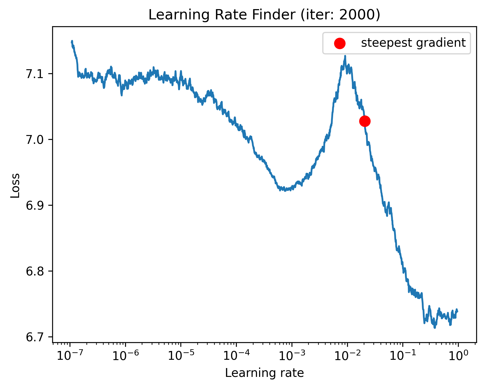

**Interpretation**  
- Loss decreases smoothly up to **~0.10–0.12**, then trends upward.  
- We selected **`--max-lr 0.125`** for OneCycleLR on AWS (used in training commands above).  
- For local runs (smaller batch), a slightly lower `max_lr` (e.g., **0.1**) is reasonable.


> **Auto-filled (from runs):** For run **`r50_imagenet1k_onecycle_amp_bs64_ep150`**, best Val Top-1 = **77.82%**, Top-5 = **93.82%** at epoch **228**.

---
## 6) Training and Evaluation Summary

This section consolidates the training results and performance comparison between **Local (RTX 4060 Ti)** and **AWS (g5.xlarge A10G)** runs.

---

### 🖥️ A) Single-GPU Training (Local)

**Infrastructure**

| Component | Specification |
|------------|----------------|
| **GPU** | NVIDIA RTX 4060 Ti (16 GB VRAM) |
| **CPU / RAM** | 32 GB System RAM  •  1 TB SSD |
| **OS / Runtime** | Windows 11 + PyTorch 2.x (AMP enabled) |

**Training Profile**

| Parameter | Value |
|------------|--------|
| **Epochs** | ≈ 250  (1 hr / epoch → ~240 hrs total) |
| **Batch Size** | 64 |
| **Max LR** | 0.0125 |
| **Scheduler** | OneCycleLR |
| **Precision** | Automatic Mixed Precision (AMP) |
| **Optimizations** | Checkpointing • Pin Memory • Multi-worker DataLoader • Label Smoothing • Standard Augmentations |

**Auto-filled Metrics** (from `out/r50_imagenet1k_onecycle_amp_bs64_ep150/train_log.csv`)

| Metric | Value |
|--------|--------|
| Training Top-1 | 82.63% |
| Training Top-5 | 94.05% |
| Validation Top-1 | 77.82% |
| Validation Top-5 | 93.82% |


**Visual Logs**

**CLI snapshot**
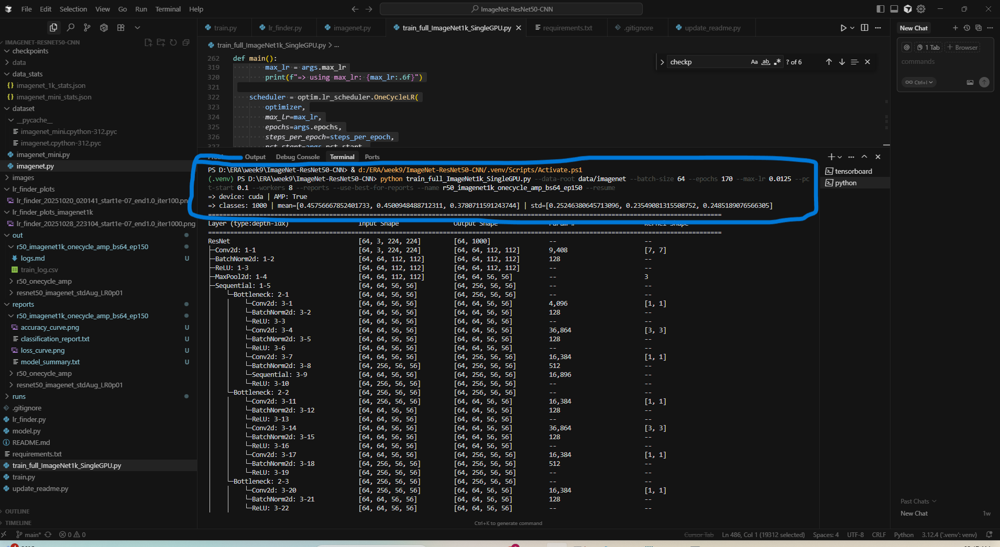

**Epoch progress**
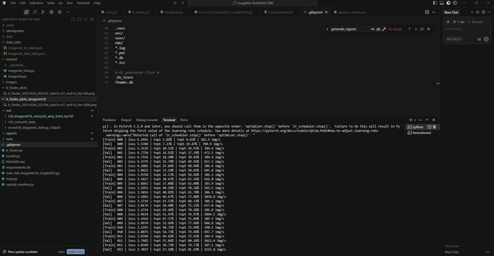
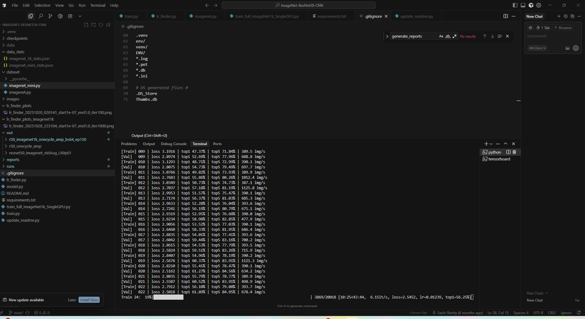

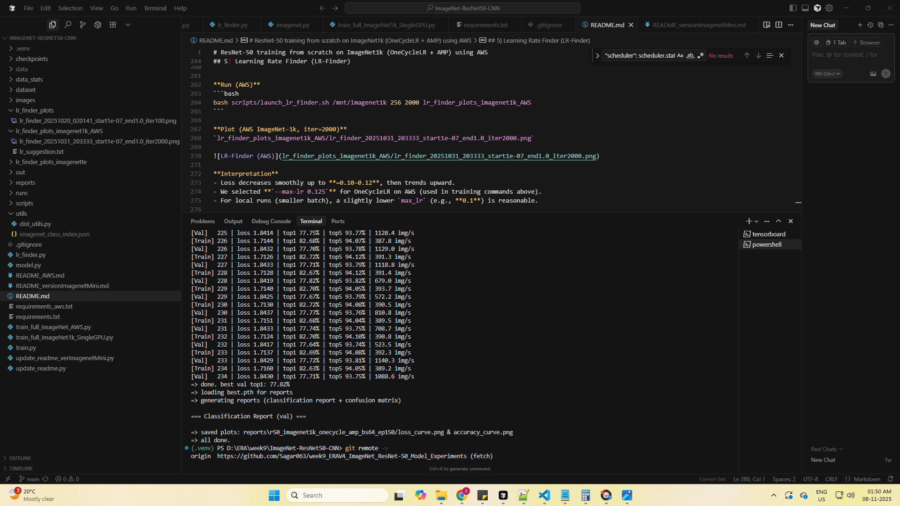

**TensorBoard metrics**
*(added TensorBoard screenshots from `runs/r50_imagenet1k_onecycle_amp_bs64_ep150`)*
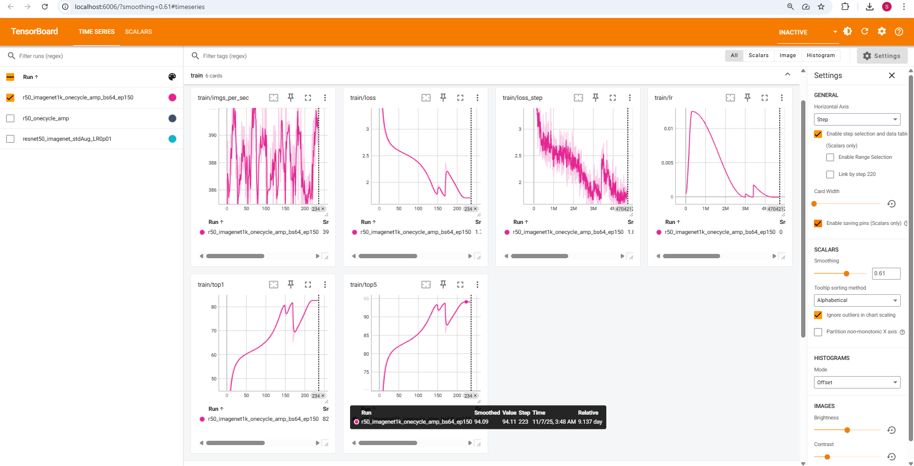
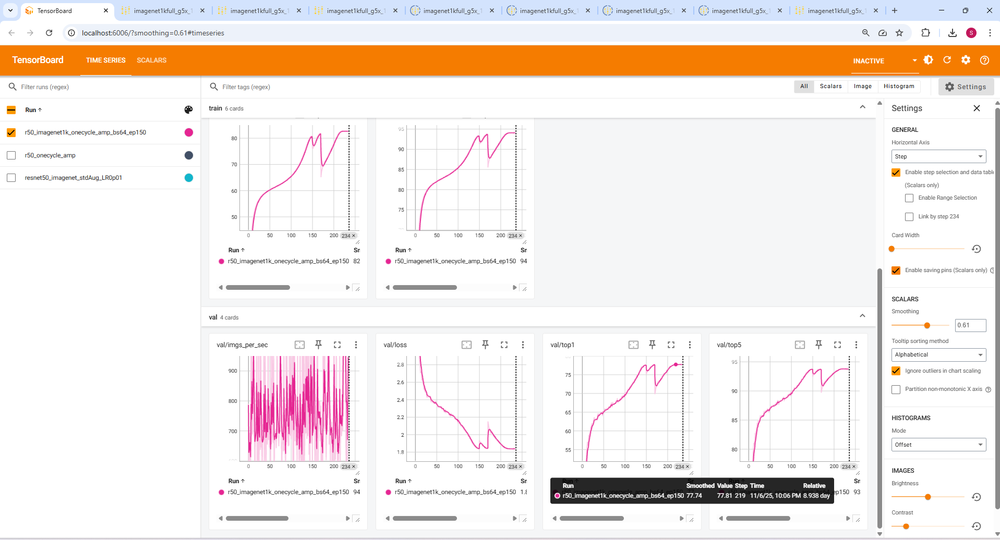

---

### ☁️ B) AWS Training (g5.xlarge A10G)

**Infrastructure**

| Component | Specification |
|------------|----------------|
| **Instance Type** | `g5.xlarge` (4 vCPU / 16 GiB RAM) |
| **GPU** | NVIDIA A10G Tensor Core (24 GB) |
| **Region** | ap-south-1 (Mumbai) |
| **Storage** | 500 GB EBS Volume mounted → `/mnt/imagenet1k` |
| **Approval** | Quota raised for 8 vCPUs of “All G and VT Spot Requests” |

**Training Profile**

| Parameter | Value |
|------------|--------|
| **Epochs Completed** | 195 |
| **Batch Size** | 256 |
| **Max LR** | 0.125 |
| **Training Time** | ~30 min / epoch  (≈ 90 hours total) |
| **Optimizations Used** | DALI pipeline • OneCycle LR • AMP • Efficient Data Loading • Distributed Sampling • tmux management • Memory/Error handling |

**Auto-filled Metrics** (from `out/imagenet1kfull_g5x_1gpu_dali_nvme_lr0p125_bs256_e150_work6/train_log.csv`)

| Metric | Value |
|--------|--------|
| Training Top-1 | 81.01% |
| Training Top-5 | 93.54% |
| Validation Top-1 | 77.66% |
| Validation Top-5 | 93.84% |


**Runtime Snapshots & Logs**

**CLI snapshot**
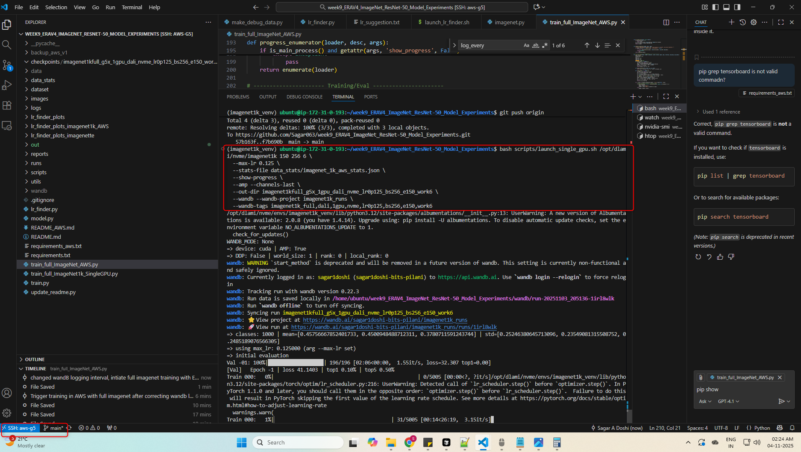

**GPU Usage Training**
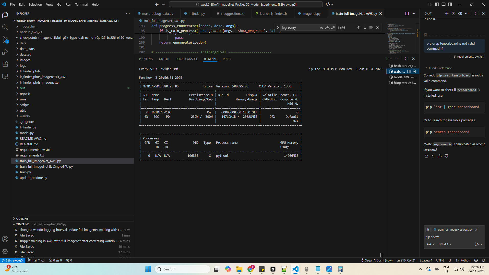

**EC2 CPU Usage Training**
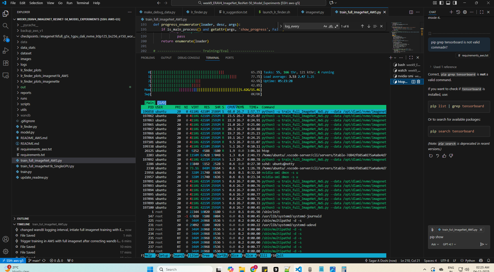

**Epoch progress**
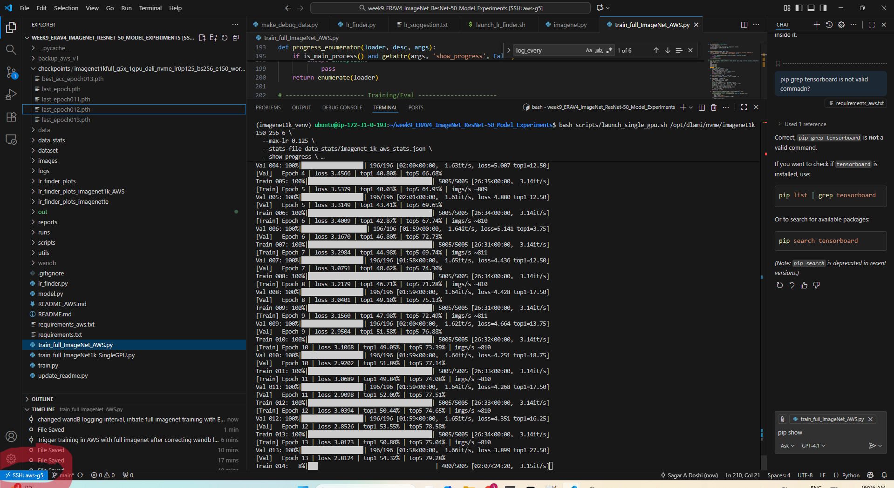
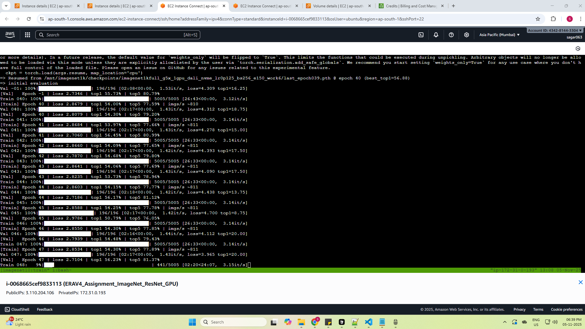
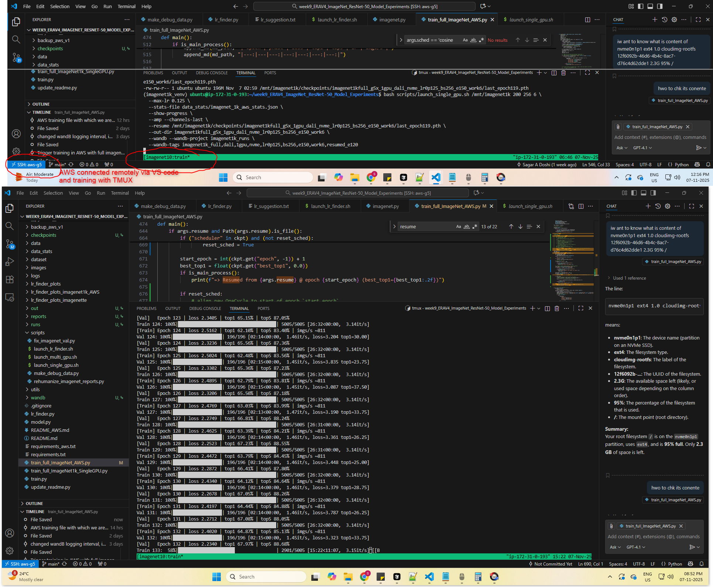


**wanbb metrics**

A consolidated W&B report combining all AWS Spot-instance runs (0–195 epochs):
[View full W&B Report — *ImageNet1k Full Combined ResNet-50 AWS Training*](https://api.wandb.ai/links/sagar1doshi-bits-pilani/i0uhx5xj)
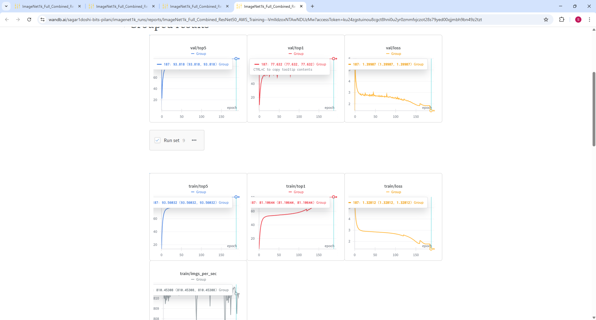
**Cost Breakdown**

| Task | Est. Cost (USD) |
|------|-----------------|
| Dataset Download + Unzip | ≈ $6 |
| Training (195 epochs) | ≈ $79 |
| **Total** | **≈ $85** |

**Notes**
- Dataset mounted at `/mnt/imagenet1k`.  
- ~2× faster per epoch vs local (run on A10G + DALI).  
- W&B Dashboard: add link → `https://wandb.ai/<user>/imagenet1k_runs`


---

**Summary Comparison**

| Feature | Local (4060 Ti) | AWS (A10G) |
|----------|-----------------|-------------|
| Batch Size | 64 | 256 |
| Total Epoch | 235 | 195 |
| Precision | AMP | AMP + DALI |
| Epoch Time | ~60 min | ~30 min |
| Total Training Hours | ~240 | ~90 |
| Best Val Top-1 | 77.82% | 77.66% |
| Best Val Top-5 | 93.82% | 93.84% |
| Storage Path | `data/imagenet` | `/mnt/imagenet1k` |

---