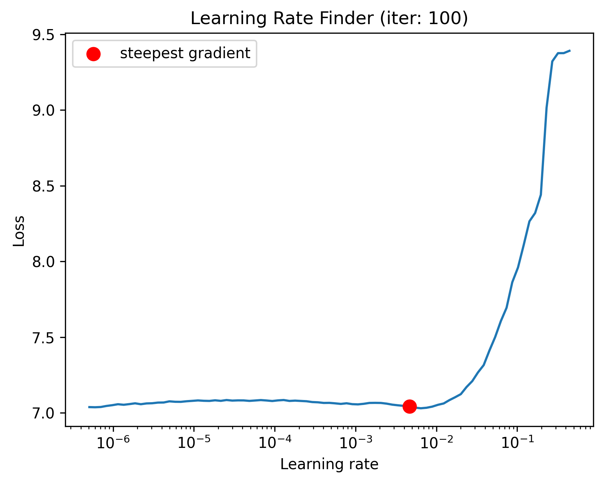
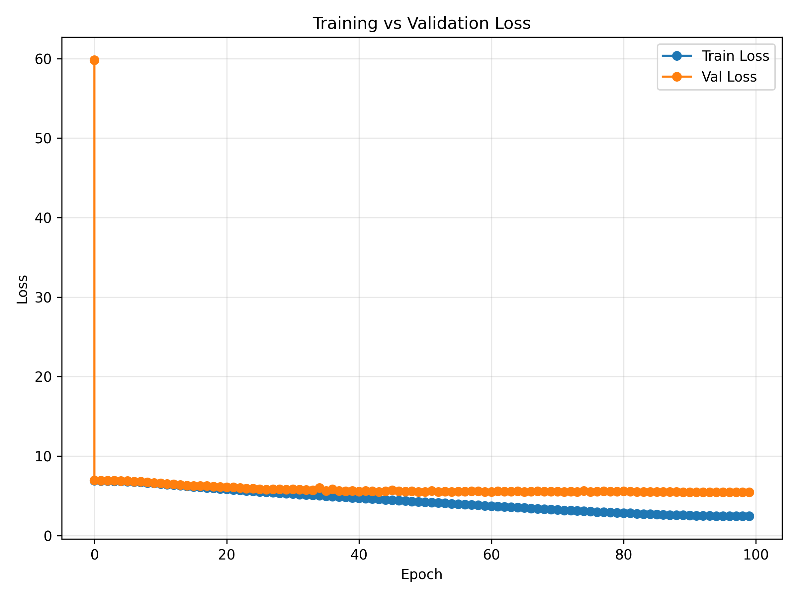
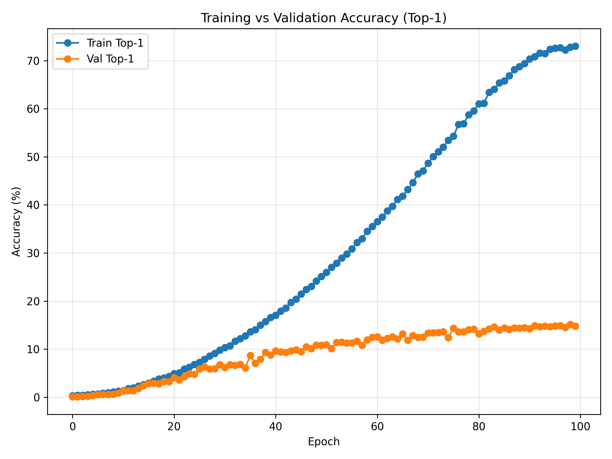

[](https://pytorch.org/)
[]()

# ResNet-50 from scratch on ImageNet-Mini (OneCycleLR + AMP)

This repository trains **ResNet-50 from scratch** on **ImageNet-Mini** using **OneCycleLR** and **mixed precision (AMP)** on a **single GPU (RTX 4060 Ti, 16 GB)**.  
Outputs include TensorBoard logs, structured CSV and Markdown training logs for each epoch, model summary, and an optional classification report
---

## 1. Overview

- **Task**: Image classification on **ImageNet-Mini (~4 GB, 1k classes)**  
- **Backbone**: ResNet-50 (from scratch, no pretrained weights)  
- **Policy**: OneCycleLR (per-batch), label smoothing, SGD momentum, WD  
- **Precision**: AMP (fp16 autocast + GradScaler)  
- **Device**: **RTX 4060 Ti (16 GB VRAM)**  
- **Monitoring**: TensorBoard + CIFAR-style CSV/Markdown logs  
- **Checkpoints**: `checkpoints/r50_onecycle_amp/{checkpoint,best}.pth`
-**TensorBoard** (recommended while training)  
> ```bash
> tensorboard --logdir runs
> ```  
> This shows scalars like `train/loss_step`, `train/lr`, `train/top1`, etc., updated live.

---

## 2. Quickstart

### 2.1 Clone & setup environment
```bash
git clone https://github.com/Sagar063/week9_ERAV4_ImageNet_ResNet-50_Model_Experiments.git
cd week9_ERAV4_ImageNet_ResNet-50_Model_Experiments
python -m venv .venv && source .venv/bin/activate      # Linux/Mac
# or
# .\.venv\Scripts\Activate.ps1                       # Windows PowerShell

pip install -r requirements.txt
```

### 2.2 Train from scratch (ImageNet-Mini)
Download Dataset (Kaggle): https://www.kaggle.com/datasets/ifigotin/imagenetmini-1000  
Place it as:
```
data/imagenet-mini/
  ├─ train/
  └─ val/
```

**Run LR-Finder (recommended)**
```bash
python lr_finder.py find_lr --num_iter 100 --end_lr 1.0 --batch_size 64
```

**Run training (single-GPU)**
```bash
python train.py --name r50_onecycle_amp --epochs 20 --batch-size 64 \
  --max-lr 0.1 --workers 8 --img-size 224 --reports
```

### 2.3 Resume from checkpoint
```bash
python train.py --name r50_onecycle_amp --resume
```

### 2.4 Key arguments
| Arg | Default | Meaning |
|---|---:|---|
| `--data-root` | `data/imagenet-mini` | Root containing `train/` and `val/` (ImageFolder) |
| `--name` | `r50_onecycle_amp` | Run/experiment name used for all output folders |
| `--epochs` | `20` | Number of epochs |
| `--batch-size` | `64` | Global batch size (single-GPU) |
| `--workers` | `8` | DataLoader workers |
| `--img-size` | `224` | Input image size |
| `--max-lr` | `None` | Peak LR (if None, uses linear scaling rule `0.1 * (batch/256)`) |
| `--pct-start` | `0.3` | Fraction of steps for LR warm-up (OneCycleLR) |
| `--div-factor` | `25.0` | Initial LR = `max_lr/div_factor` |
| `--final-div-factor` | `1e4` | Final LR = `max_lr/final_div_factor` |
| `--no-amp` | `False` | Disable AMP if set |
| `--use-class-style-aug` | `False` | Alternate augmentation style |
| `--resume` | `False` | Resume from `checkpoints/<name>/checkpoint.pth` |
| `--reports` | `False` | Generate classification report & save curves |

### 2.5 Repository layout
```
week8_ERAV4_CIFAR_100_ResNetModel_Experiments/
├─ train.py
├─ model.py
├─ lr_finder.py
├─ dataset/
│ └─ imagenet_mini.py
├─ lr_finder_plots/                  # latest LR plot is embedded above
├─ runs/r50_onecycle_amp/            # TensorBoard event files
└─ out/
│   ├─ r50_onecycle_amp/
│      ├─ train_log.csv
│      ├─ logs.md
│      └─ out/
└─ reports/
│   ├─ r50_onecycle_amp/
│       ├─ accuracy_curve.png
│       ├─ classification_report.txt
│       └─ confusion_matrix.csv
│       ├─ loss_curve.png
│       └─ model_summary.txt
└─ images/
│   ├─ {imagenet_samples.png,resnet50_arch.png}  # OPTIONAL:  images
├─ update_readme.py
├─ README.md

```

---

## 3. About ImageNet

**ImageNet** is one of the most influential datasets in computer vision research.  
It contains over **14 million labeled images** organized into more than **22,000 categories**, and has become the foundation for evaluating and benchmarking deep neural networks for image classification and object recognition.

For this iteration, we use **ImageNet-Mini**, a curated **1,000-class subset (~4 GB)** derived from the ImageNet-1K dataset.  
It maintains the same structure and class diversity but is dramatically smaller, making it ideal for **rapid experimentation**, **debugging pipelines**, and **prototyping architectures** locally before scaling to full ImageNet-1K.

**Key Highlights:**
- 📚 **Standard Benchmark:** Widely used for assessing model accuracy and robustness.  
- ⚙️ **Lightweight & Scalable:** Enables faster iteration on consumer GPUs.  
- 🎯 **Diverse Classes:** Includes animals, vehicles, natural scenes, and household objects.  
- 🧩 **Transfer Learning Hub:** Models pretrained on ImageNet form the backbone of countless computer-vision systems.

### Sample Classes and Images

  
*ImageNet-Mini sample classes and images.*

---

## 4. About ResNet-50

**ResNet-50** (He et al., 2015) is a deep convolutional neural network consisting of **50 layers** built on the concept of *residual learning*.  
Residual connections (skip connections) allow gradients to flow more effectively through very deep networks, mitigating the **vanishing-gradient problem** and enabling the successful training of extremely deep CNNs.

**Key Features:**
- 🧩 **Residual Blocks:** Learn identity mappings that help deeper networks converge faster.  
- ⚙️ **Bottleneck Design:** Uses 1×1, 3×3, and 1×1 convolutions to balance accuracy and computation.  
- 🧠 **Depth:** 48 convolutional + 1 max-pool + 1 average-pool + 1 fully-connected layer (≈ 25.6 M parameters).  
- 🎯 **Input:** 224 × 224 × 3 images  **Output:** 1000 classes (ImageNet-1K).  
- 🚀 **Impact:** ResNet architectures revolutionized deep learning and remain a standard backbone for modern vision models.

### Architecture Diagram

  
*Residual Networks (ResNet-50) architecture.*

---

## 5. Learning Rate Finder (LR-Finder)

Before starting full training, we run a **Learning Rate Finder (LR-Finder)** to determine an optimal `--max-lr` value for the **OneCycleLR** policy.  
This ensures faster and more stable convergence by selecting a learning rate that is high enough to accelerate training but low enough to avoid divergence.

### 🔍 Why we use LR-Finder

- 🚀 **Eliminates guesswork:** Automatically finds the ideal learning-rate range.  
- ⚖️ **Improves efficiency:** Prevents wasting epochs on suboptimal LRs.  
- 📈 **Optimizes OneCycleLR:** The discovered LR becomes the peak (`max_lr`) in the OneCycle schedule.  
- 💡 **Enhances reproducibility:** The LR-Finder curve can be regenerated anytime before training.

### ⚙️ How it works

The script [`lr_finder.py`](lr_finder.py) performs a **learning-rate range test** using `torch_lr_finder.LRFinder`.  
You can run it as:

```bash
python lr_finder.py find_lr \
  --start_lr 1e-7 \
  --end_lr 1.0 \
  --num_iter 100 \
  --batch_size 64

```
### ⚙️ What happens internally
- Initializes a ResNet-50 model (no pretrained weights) and builds the ImageNet-Mini training DataLoader.
- Starts from a learning rate of 1e-7 and increases it exponentially up to 1.0 over 100 iterations.
- Tracks the instantaneous training loss for each mini-batch.
- Plots Loss vs Learning Rate and saves the curve to lr_finder_plots/.

### 📈 Observation — My Experiment

Below is the LR-Finder curve obtained from my ImageNet-Mini run (`iter: 100`):



**Interpretation:**
- The x-axis shows the **learning rate**, and the y-axis shows the **training loss**.  
- For very small learning rates (< 1e-5), the loss stays almost flat — learning is too slow.
- Between 1e-4 and 3e-3, the loss starts to drop steadily — the network begins learning efficiently.
- After ≈ 1e-2, the loss shoots up — indicating instability and divergence.

🟢 Optimal LR range: Between 1e-3 and 3e-2.
🟢 Suggested LR: 4.64 × 10⁻³ (steepest descent region), which is automatically reported by the script (lr_finder.suggestion()).
This value is selected as the --max-lr for the OneCycleLR schedule.

### 🧩 Using the result
The suggested LR is used as the peak learning rate (--max-lr) for the OneCycleLR scheduler in the main training script.
During training, OneCycleLR starts below this LR, ramps up to it, and then gradually decays — forming a smooth, single-cycle learning-rate curve across all epochs.

Final Training Command:
```bash
python train.py --name r50_onecycle_amp \
  --epochs 20 \
  --batch-size 64 \
  --max-lr 0.0046 \
  --workers 8 \
  --img-size 224 \
  --reports
```
The LR-Finder ensures that the OneCycleLR schedule begins with a well-calibrated peak learning rate — leading to faster convergence, better stability, and improved final accuracy.
---

## 6. Results Summary — `r50_onecycle_amp`

**Curves**
- Loss: `reports/r50_onecycle_amp/loss_curve.png`  
- Accuracy (Top-1 / Top-5): `reports/r50_onecycle_amp/accuracy_curve.png`




**Metrics** (from `out/r50_onecycle_amp/train_log.csv`)
| Split | Top-1 (%) | Top-5 (%) | Loss | Throughput (img/s) |
|---|---:|---:|---:|---:|
| Val (best) | 15.1415 | 32.5006 | 5.456362 | 827.05 |
| Val (final) | 14.8101 | 33.0614 | 5.446987 | 947.88 |

> Exact values are auto-filled by `update_readme.py`.

---

## 7. Detailed Results & Observations

### 7.1 Training logs (markdown)
<details><summary>Show logs.md</summary>

```text
# Training Logs (terminal-like)
# Training Logs (terminal-like)

```
[Val] Epoch 000 | loss 59.8246 | top1 0.10% | top5 0.54% | lr 0.000184 | ips 152.1
[Train] Epoch 000 | loss 6.9264 | top1 0.33% | top5 1.20% | lr 0.000196 | ips 314.4
[Val] Epoch 000 | loss 6.9538 | top1 0.08% | top5 0.89% | lr 0.000196 | ips 927.7
[Train] Epoch 001 | loss 6.8762 | top1 0.42% | top5 1.48% | lr 0.000232 | ips 390.3
[Val] Epoch 001 | loss 6.9103 | top1 0.08% | top5 1.10% | lr 0.000232 | ips 903.2
[Train] Epoch 002 | loss 6.8616 | top1 0.41% | top5 1.59% | lr 0.000292 | ips 391.3
[Val] Epoch 002 | loss 6.9076 | top1 0.13% | top5 1.10% | lr 0.000292 | ips 943.6
[Train] Epoch 003 | loss 6.8513 | top1 0.50% | top5 1.73% | lr 0.000375 | ips 390.1
[Val] Epoch 003 | loss 6.9211 | top1 0.23% | top5 1.33% | lr 0.000375 | ips 937.5
[Train] Epoch 004 | loss 6.8377 | top1 0.61% | top5 2.02% | lr 0.000480 | ips 391.3
[Val] Epoch 004 | loss 6.8895 | top1 0.38% | top5 1.43% | lr 0.000480 | ips 941.9
[Train] Epoch 005 | loss 6.8087 | top1 0.66% | top5 2.29% | lr 0.000606 | ips 391.7
[Val] Epoch 005 | loss 6.8583 | top1 0.54% | top5 1.78% | lr 0.000606 | ips 938.9
[Train] Epoch 006 | loss 6.7597 | top1 0.83% | top5 2.71% | lr 0.000751 | ips 391.6
[Val] Epoch 006 | loss 6.8012 | top1 0.59% | top5 2.06% | lr 0.000751 | ips 941.4
[Train] Epoch 007 | loss 6.6958 | top1 0.94% | top5 3.20% | lr 0.000915 | ips 391.4
[Val] Epoch 007 | loss 6.7767 | top1 0.59% | top5 2.80% | lr 0.000915 | ips 944.4
[Train] Epoch 008 | loss 6.6349 | top1 1.12% | top5 3.74% | lr 0.001094 | ips 391.8
[Val] Epoch 008 | loss 6.6948 | top1 0.61% | top5 3.01% | lr 0.001094 | ips 936.7
[Train] Epoch 009 | loss 6.5702 | top1 1.24% | top5 4.26% | lr 0.001288 | ips 391.7
[Val] Epoch 009 | loss 6.6360 | top1 0.89% | top5 3.90% | lr 0.001288 | ips 940.7
[Train] Epoch 010 | loss 6.5026 | top1 1.37% | top5 4.88% | lr 0.001494 | ips 391.8
[Val] Epoch 010 | loss 6.5721 | top1 1.33% | top5 4.36% | lr 0.001494 | ips 943.5
[Train] Epoch 011 | loss 6.4243 | top1 1.79% | top5 5.82% | lr 0.001710 | ips 391.2
[Val] Epoch 011 | loss 6.5064 | top1 1.35% | top5 5.07% | lr 0.001710 | ips 946.3
[Train] Epoch 012 | loss 6.3595 | top1 1.94% | top5 6.22% | lr 0.001933 | ips 392.0
[Val] Epoch 012 | loss 6.4372 | top1 1.35% | top5 5.68% | lr 0.001933 | ips 953.2
[Train] Epoch 013 | loss 6.2716 | top1 2.32% | top5 7.53% | lr 0.002161 | ips 391.7
[Val] Epoch 013 | loss 6.3909 | top1 1.86% | top5 6.45% | lr 0.002161 | ips 944.1
[Train] Epoch 014 | loss 6.1982 | top1 2.66% | top5 8.23% | lr 0.002392 | ips 391.9
[Val] Epoch 014 | loss 6.2936 | top1 2.42% | top5 7.95% | lr 0.002392 | ips 940.8
[Train] Epoch 015 | loss 6.1362 | top1 2.96% | top5 9.40% | lr 0.002623 | ips 391.4
[Val] Epoch 015 | loss 6.2414 | top1 2.88% | top5 8.59% | lr 0.002623 | ips 946.8
[Train] Epoch 016 | loss 6.0699 | top1 3.32% | top5 10.24% | lr 0.002851 | ips 391.4
[Val] Epoch 016 | loss 6.2289 | top1 2.91% | top5 9.25% | lr 0.002851 | ips 944.8
[Train] Epoch 017 | loss 6.0009 | top1 3.82% | top5 11.49% | lr 0.003075 | ips 392.0
[Val] Epoch 017 | loss 6.2644 | top1 2.80% | top5 8.67% | lr 0.003075 | ips 958.8
[Train] Epoch 018 | loss 5.9508 | top1 4.03% | top5 12.19% | lr 0.003290 | ips 392.2
[Val] Epoch 018 | loss 6.1624 | top1 3.29% | top5 10.53% | lr 0.003290 | ips 933.1
[Train] Epoch 019 | loss 5.8919 | top1 4.33% | top5 13.03% | lr 0.003496 | ips 392.3
[Val] Epoch 019 | loss 6.1367 | top1 3.24% | top5 10.45% | lr 0.003496 | ips 939.3
[Train] Epoch 020 | loss 5.8263 | top1 4.93% | top5 14.33% | lr 0.003690 | ips 391.8
[Val] Epoch 020 | loss 6.0851 | top1 4.05% | top5 11.80% | lr 0.003690 | ips 933.4
[Train] Epoch 021 | loss 5.7624 | top1 5.08% | top5 15.36% | lr 0.003870 | ips 392.0
[Val] Epoch 021 | loss 6.0825 | top1 3.59% | top5 11.60% | lr 0.003870 | ips 938.9
[Train] Epoch 022 | loss 5.6987 | top1 5.90% | top5 16.42% | lr 0.004033 | ips 392.0
[Val] Epoch 022 | loss 6.0106 | top1 4.31% | top5 12.77% | lr 0.004033 | ips 940.3
[Train] Epoch 023 | loss 5.6370 | top1 6.23% | top5 17.76% | lr 0.004179 | ips 392.1
[Val] Epoch 023 | loss 5.9144 | top1 4.89% | top5 14.27% | lr 0.004179 | ips 938.9
[Train] Epoch 024 | loss 5.5799 | top1 6.81% | top5 19.01% | lr 0.004304 | ips 392.3
[Val] Epoch 024 | loss 5.9337 | top1 4.74% | top5 14.48% | lr 0.004304 | ips 942.5
[Train] Epoch 025 | loss 5.5093 | top1 7.25% | top5 20.35% | lr 0.004409 | ips 391.6
[Val] Epoch 025 | loss 5.8360 | top1 5.89% | top5 16.24% | lr 0.004409 | ips 950.8
[Train] Epoch 026 | loss 5.4620 | top1 7.90% | top5 21.47% | lr 0.004492 | ips 392.3
[Val] Epoch 026 | loss 5.8094 | top1 6.30% | top5 16.21% | lr 0.004492 | ips 938.6
[Train] Epoch 027 | loss 5.4042 | top1 8.56% | top5 22.39% | lr 0.004552 | ips 391.8
[Val] Epoch 027 | loss 5.8248 | top1 5.89% | top5 16.39% | lr 0.004552 | ips 937.3
[Train] Epoch 028 | loss 5.3438 | top1 9.11% | top5 23.82% | lr 0.004588 | ips 391.6
[Val] Epoch 028 | loss 5.8353 | top1 5.94% | top5 16.93% | lr 0.004588 | ips 939.1
[Train] Epoch 029 | loss 5.2895 | top1 9.80% | top5 24.69% | lr 0.004600 | ips 392.4
[Val] Epoch 029 | loss 5.7696 | top1 6.78% | top5 17.08% | lr 0.004600 | ips 944.7
[Train] Epoch 030 | loss 5.2298 | top1 10.34% | top5 25.82% | lr 0.004598 | ips 392.0
[Val] Epoch 030 | loss 5.8271 | top1 6.22% | top5 17.21% | lr 0.004598 | ips 937.2
[Train] Epoch 031 | loss 5.1833 | top1 10.70% | top5 26.83% | lr 0.004591 | ips 391.7
[Val] Epoch 031 | loss 5.8064 | top1 6.76% | top5 17.82% | lr 0.004591 | ips 945.2
[Train] Epoch 032 | loss 5.1230 | top1 11.64% | top5 28.26% | lr 0.004579 | ips 392.1
[Val] Epoch 032 | loss 5.7638 | top1 6.60% | top5 18.97% | lr 0.004579 | ips 936.7
[Train] Epoch 033 | loss 5.0742 | top1 12.18% | top5 29.48% | lr 0.004563 | ips 391.6
[Val] Epoch 033 | loss 5.7267 | top1 6.83% | top5 19.50% | lr 0.004563 | ips 947.7
[Train] Epoch 034 | loss 5.0247 | top1 12.80% | top5 30.61% | lr 0.004542 | ips 392.2
[Val] Epoch 034 | loss 5.9778 | top1 6.09% | top5 16.47% | lr 0.004542 | ips 945.9
[Train] Epoch 035 | loss 4.9758 | top1 13.61% | top5 31.91% | lr 0.004517 | ips 392.0
[Val] Epoch 035 | loss 5.6411 | top1 8.67% | top5 21.95% | lr 0.004517 | ips 940.1
[Train] Epoch 036 | loss 4.9152 | top1 14.07% | top5 33.12% | lr 0.004487 | ips 391.9
[Val] Epoch 036 | loss 5.8122 | top1 7.06% | top5 19.42% | lr 0.004487 | ips 942.2
[Train] Epoch 037 | loss 4.8556 | top1 14.98% | top5 34.91% | lr 0.004453 | ips 392.2
[Val] Epoch 037 | loss 5.6188 | top1 7.90% | top5 22.33% | lr 0.004453 | ips 945.0
[Train] Epoch 038 | loss 4.8099 | top1 15.75% | top5 35.43% | lr 0.004415 | ips 392.0
[Val] Epoch 038 | loss 5.5879 | top1 9.30% | top5 23.17% | lr 0.004415 | ips 938.0
[Train] Epoch 039 | loss 4.7572 | top1 16.59% | top5 37.10% | lr 0.004372 | ips 391.8
[Val] Epoch 039 | loss 5.6123 | top1 8.77% | top5 22.87% | lr 0.004372 | ips 953.3
[Train] Epoch 040 | loss 4.7116 | top1 17.05% | top5 37.93% | lr 0.004325 | ips 391.6
[Val] Epoch 040 | loss 5.5481 | top1 9.64% | top5 24.73% | lr 0.004325 | ips 939.1
[Train] Epoch 041 | loss 4.6655 | top1 17.92% | top5 39.52% | lr 0.004274 | ips 392.3
[Val] Epoch 041 | loss 5.6022 | top1 9.41% | top5 23.53% | lr 0.004274 | ips 935.3
[Train] Epoch 042 | loss 4.6153 | top1 18.57% | top5 40.39% | lr 0.004219 | ips 392.4
[Val] Epoch 042 | loss 5.5716 | top1 9.33% | top5 24.11% | lr 0.004219 | ips 940.4
[Train] Epoch 043 | loss 4.5695 | top1 19.72% | top5 41.72% | lr 0.004161 | ips 391.8
[Val] Epoch 043 | loss 5.5105 | top1 9.66% | top5 25.29% | lr 0.004161 | ips 944.4
[Train] Epoch 044 | loss 4.5168 | top1 20.38% | top5 43.14% | lr 0.004098 | ips 391.3
[Val] Epoch 044 | loss 5.5858 | top1 9.86% | top5 24.96% | lr 0.004098 | ips 930.3
[Train] Epoch 045 | loss 4.4449 | top1 21.48% | top5 44.83% | lr 0.004032 | ips 392.0
[Val] Epoch 045 | loss 5.7255 | top1 9.48% | top5 23.68% | lr 0.004032 | ips 951.6
[Train] Epoch 046 | loss 4.3979 | top1 22.40% | top5 45.88% | lr 0.003962 | ips 391.8
[Val] Epoch 046 | loss 5.5653 | top1 10.50% | top5 25.85% | lr 0.003962 | ips 930.6
[Train] Epoch 047 | loss 4.3528 | top1 23.04% | top5 47.14% | lr 0.003889 | ips 391.7
[Val] Epoch 047 | loss 5.5256 | top1 10.09% | top5 26.23% | lr 0.003889 | ips 943.6
[Train] Epoch 048 | loss 4.2997 | top1 24.15% | top5 48.29% | lr 0.003813 | ips 392.0
[Val] Epoch 048 | loss 5.5729 | top1 10.88% | top5 26.26% | lr 0.003813 | ips 948.7
[Train] Epoch 049 | loss 4.2470 | top1 25.13% | top5 49.34% | lr 0.003734 | ips 391.8
[Val] Epoch 049 | loss 5.4769 | top1 10.83% | top5 27.20% | lr 0.003734 | ips 948.8
[Train] Epoch 050 | loss 4.1921 | top1 26.00% | top5 51.24% | lr 0.003652 | ips 391.8
[Val] Epoch 050 | loss 5.5097 | top1 10.91% | top5 26.61% | lr 0.003652 | ips 943.2
[Train] Epoch 051 | loss 4.1522 | top1 27.03% | top5 51.89% | lr 0.003567 | ips 392.1
[Val] Epoch 051 | loss 5.6173 | top1 10.15% | top5 25.34% | lr 0.003567 | ips 938.0
[Train] Epoch 052 | loss 4.1054 | top1 27.87% | top5 53.04% | lr 0.003480 | ips 391.8
[Val] Epoch 052 | loss 5.5085 | top1 11.39% | top5 27.48% | lr 0.003480 | ips 948.8
[Train] Epoch 053 | loss 4.0614 | top1 28.93% | top5 54.57% | lr 0.003390 | ips 392.2
[Val] Epoch 053 | loss 5.5275 | top1 11.42% | top5 27.25% | lr 0.003390 | ips 940.8
[Train] Epoch 054 | loss 4.0055 | top1 29.78% | top5 55.57% | lr 0.003298 | ips 391.8
[Val] Epoch 054 | loss 5.5145 | top1 11.27% | top5 28.17% | lr 0.003298 | ips 948.4
[Train] Epoch 055 | loss 3.9612 | top1 30.87% | top5 56.58% | lr 0.003204 | ips 392.2
[Val] Epoch 055 | loss 5.5490 | top1 11.29% | top5 27.86% | lr 0.003204 | ips 933.1
[Train] Epoch 056 | loss 3.8996 | top1 32.17% | top5 57.97% | lr 0.003108 | ips 392.0
[Val] Epoch 056 | loss 5.5360 | top1 11.65% | top5 27.50% | lr 0.003108 | ips 940.1
[Train] Epoch 057 | loss 3.8581 | top1 33.00% | top5 59.48% | lr 0.003011 | ips 392.2
[Val] Epoch 057 | loss 5.6013 | top1 10.78% | top5 26.92% | lr 0.003011 | ips 944.4
[Train] Epoch 058 | loss 3.8108 | top1 34.49% | top5 60.42% | lr 0.002912 | ips 392.1
[Val] Epoch 058 | loss 5.5624 | top1 11.93% | top5 28.17% | lr 0.002912 | ips 953.4
[Train] Epoch 059 | loss 3.7513 | top1 35.52% | top5 61.84% | lr 0.002812 | ips 391.9
[Val] Epoch 059 | loss 5.5049 | top1 12.46% | top5 29.31% | lr 0.002812 | ips 926.7
[Train] Epoch 060 | loss 3.7081 | top1 36.53% | top5 62.86% | lr 0.002711 | ips 392.2
[Val] Epoch 060 | loss 5.4864 | top1 12.57% | top5 28.96% | lr 0.002711 | ips 946.1
[Train] Epoch 061 | loss 3.6628 | top1 37.46% | top5 63.87% | lr 0.002609 | ips 391.7
[Val] Epoch 061 | loss 5.5897 | top1 11.88% | top5 28.40% | lr 0.002609 | ips 939.3
[Train] Epoch 062 | loss 3.6202 | top1 38.76% | top5 64.78% | lr 0.002506 | ips 392.1
[Val] Epoch 062 | loss 5.5293 | top1 12.26% | top5 29.19% | lr 0.002506 | ips 941.0
[Train] Epoch 063 | loss 3.5870 | top1 39.72% | top5 65.77% | lr 0.002403 | ips 392.3
[Val] Epoch 063 | loss 5.5249 | top1 12.54% | top5 29.57% | lr 0.002403 | ips 937.3
[Train] Epoch 064 | loss 3.5211 | top1 41.15% | top5 67.26% | lr 0.002300 | ips 392.2
[Val] Epoch 064 | loss 5.5701 | top1 12.16% | top5 29.11% | lr 0.002300 | ips 936.6
[Train] Epoch 065 | loss 3.4844 | top1 41.81% | top5 68.12% | lr 0.002197 | ips 392.4
[Val] Epoch 065 | loss 5.5171 | top1 13.18% | top5 29.98% | lr 0.002197 | ips 937.5
[Train] Epoch 066 | loss 3.4318 | top1 43.20% | top5 69.50% | lr 0.002094 | ips 391.8
[Val] Epoch 066 | loss 5.5427 | top1 11.88% | top5 29.44% | lr 0.002094 | ips 946.6
[Train] Epoch 067 | loss 3.3888 | top1 44.63% | top5 70.54% | lr 0.001991 | ips 392.3
[Val] Epoch 067 | loss 5.5632 | top1 12.82% | top5 28.98% | lr 0.001991 | ips 934.8
[Train] Epoch 068 | loss 3.3320 | top1 46.46% | top5 71.93% | lr 0.001889 | ips 392.3
[Val] Epoch 068 | loss 5.5281 | top1 12.44% | top5 30.38% | lr 0.001889 | ips 939.6
[Train] Epoch 069 | loss 3.2906 | top1 47.10% | top5 72.70% | lr 0.001788 | ips 391.8
[Val] Epoch 069 | loss 5.5518 | top1 12.52% | top5 30.33% | lr 0.001788 | ips 937.0
[Train] Epoch 070 | loss 3.2411 | top1 48.69% | top5 73.73% | lr 0.001688 | ips 391.7
[Val] Epoch 070 | loss 5.5227 | top1 13.36% | top5 30.41% | lr 0.001688 | ips 942.4
[Train] Epoch 071 | loss 3.1818 | top1 50.05% | top5 74.83% | lr 0.001589 | ips 392.0
[Val] Epoch 071 | loss 5.5127 | top1 13.41% | top5 30.10% | lr 0.001589 | ips 940.7
[Train] Epoch 072 | loss 3.1496 | top1 51.08% | top5 75.58% | lr 0.001492 | ips 391.7
[Val] Epoch 072 | loss 5.5273 | top1 13.46% | top5 30.77% | lr 0.001492 | ips 933.6
[Train] Epoch 073 | loss 3.1184 | top1 52.03% | top5 76.44% | lr 0.001396 | ips 392.1
[Val] Epoch 073 | loss 5.5035 | top1 13.64% | top5 31.23% | lr 0.001396 | ips 937.2
[Train] Epoch 074 | loss 3.0749 | top1 53.46% | top5 77.20% | lr 0.001302 | ips 391.8
[Val] Epoch 074 | loss 5.6055 | top1 12.39% | top5 30.10% | lr 0.001302 | ips 940.3
[Train] Epoch 075 | loss 3.0418 | top1 54.30% | top5 78.03% | lr 0.001210 | ips 391.7
[Val] Epoch 075 | loss 5.4964 | top1 14.35% | top5 30.46% | lr 0.001210 | ips 932.7
[Train] Epoch 076 | loss 2.9616 | top1 56.72% | top5 79.53% | lr 0.001120 | ips 391.7
[Val] Epoch 076 | loss 5.5553 | top1 13.64% | top5 30.84% | lr 0.001120 | ips 939.0
[Train] Epoch 077 | loss 2.9539 | top1 56.90% | top5 79.67% | lr 0.001033 | ips 391.2
[Val] Epoch 077 | loss 5.5645 | top1 13.61% | top5 30.74% | lr 0.001033 | ips 943.0
[Train] Epoch 078 | loss 2.9035 | top1 58.77% | top5 80.60% | lr 0.000948 | ips 392.1
[Val] Epoch 078 | loss 5.5281 | top1 14.05% | top5 31.30% | lr 0.000948 | ips 930.9
[Train] Epoch 079 | loss 2.8656 | top1 59.53% | top5 81.28% | lr 0.000866 | ips 391.8
[Val] Epoch 079 | loss 5.5246 | top1 14.15% | top5 31.12% | lr 0.000866 | ips 941.0
[Train] Epoch 080 | loss 2.8205 | top1 61.02% | top5 82.22% | lr 0.000787 | ips 392.0
[Val] Epoch 080 | loss 5.5825 | top1 13.18% | top5 31.23% | lr 0.000787 | ips 948.2
[Train] Epoch 081 | loss 2.8093 | top1 61.11% | top5 82.40% | lr 0.000710 | ips 392.3
[Val] Epoch 081 | loss 5.5459 | top1 13.71% | top5 31.56% | lr 0.000710 | ips 939.0
[Train] Epoch 082 | loss 2.7490 | top1 63.43% | top5 83.44% | lr 0.000637 | ips 391.7
[Val] Epoch 082 | loss 5.5037 | top1 14.20% | top5 31.81% | lr 0.000637 | ips 945.7
[Train] Epoch 083 | loss 2.7157 | top1 64.07% | top5 84.10% | lr 0.000568 | ips 391.8
[Val] Epoch 083 | loss 5.5119 | top1 14.61% | top5 31.58% | lr 0.000568 | ips 933.1
[Train] Epoch 084 | loss 2.6834 | top1 65.37% | top5 84.78% | lr 0.000502 | ips 391.7
[Val] Epoch 084 | loss 5.5167 | top1 13.97% | top5 32.09% | lr 0.000502 | ips 948.0
[Train] Epoch 085 | loss 2.6604 | top1 65.79% | top5 85.08% | lr 0.000439 | ips 392.4
[Val] Epoch 085 | loss 5.4824 | top1 14.43% | top5 32.22% | lr 0.000439 | ips 936.6
[Train] Epoch 086 | loss 2.6262 | top1 66.86% | top5 85.52% | lr 0.000380 | ips 391.9
[Val] Epoch 086 | loss 5.4949 | top1 14.12% | top5 31.86% | lr 0.000380 | ips 932.3
[Train] Epoch 087 | loss 2.5845 | top1 68.15% | top5 86.12% | lr 0.000325 | ips 391.8
[Val] Epoch 087 | loss 5.4990 | top1 14.43% | top5 31.66% | lr 0.000325 | ips 944.9
[Train] Epoch 088 | loss 2.5707 | top1 68.79% | top5 86.48% | lr 0.000275 | ips 391.9
[Val] Epoch 088 | loss 5.5000 | top1 14.38% | top5 32.53% | lr 0.000275 | ips 946.0
[Train] Epoch 089 | loss 2.5587 | top1 69.41% | top5 86.52% | lr 0.000228 | ips 392.0
[Val] Epoch 089 | loss 5.4745 | top1 14.45% | top5 32.58% | lr 0.000228 | ips 936.5
[Train] Epoch 090 | loss 2.5223 | top1 70.37% | top5 87.07% | lr 0.000185 | ips 392.2
[Val] Epoch 090 | loss 5.4596 | top1 14.27% | top5 32.76% | lr 0.000185 | ips 941.2
[Train] Epoch 091 | loss 2.5037 | top1 70.82% | top5 87.54% | lr 0.000147 | ips 392.1
[Val] Epoch 091 | loss 5.4761 | top1 14.89% | top5 32.73% | lr 0.000147 | ips 942.5
[Train] Epoch 092 | loss 2.4853 | top1 71.59% | top5 87.74% | lr 0.000113 | ips 392.2
[Val] Epoch 092 | loss 5.4760 | top1 14.66% | top5 32.45% | lr 0.000113 | ips 944.8
[Train] Epoch 093 | loss 2.4808 | top1 71.48% | top5 87.92% | lr 0.000083 | ips 392.3
[Val] Epoch 093 | loss 5.4656 | top1 14.81% | top5 33.16% | lr 0.000083 | ips 937.7
[Train] Epoch 094 | loss 2.4581 | top1 72.36% | top5 88.04% | lr 0.000058 | ips 392.0
[Val] Epoch 094 | loss 5.4676 | top1 14.66% | top5 32.73% | lr 0.000058 | ips 931.9
[Train] Epoch 095 | loss 2.4416 | top1 72.61% | top5 88.50% | lr 0.000037 | ips 392.2
[Val] Epoch 095 | loss 5.4648 | top1 14.86% | top5 32.58% | lr 0.000037 | ips 932.7
[Train] Epoch 096 | loss 2.4505 | top1 72.70% | top5 88.30% | lr 0.000021 | ips 392.2
[Val] Epoch 096 | loss 5.4480 | top1 14.91% | top5 33.37% | lr 0.000021 | ips 934.6
[Train] Epoch 097 | loss 2.4555 | top1 72.21% | top5 88.22% | lr 0.000009 | ips 391.8
[Val] Epoch 097 | loss 5.4493 | top1 14.50% | top5 33.06% | lr 0.000009 | ips 943.1
[Train] Epoch 098 | loss 2.4463 | top1 72.80% | top5 88.32% | lr 0.000002 | ips 391.4
[Val] Epoch 098 | loss 5.4564 | top1 15.14% | top5 32.50% | lr 0.000002 | ips 827.0
[Train] Epoch 099 | loss 2.4360 | top1 73.02% | top5 88.43% | lr 0.000000 | ips 390.3
[Val] Epoch 099 | loss 5.4470 | top1 14.81% | top5 33.06% | lr 0.000000 | ips 947.9
```
```
</details>

### 7.2 Model summary
<details><summary>Show model_summary.txt</summary>

```text
============================================================================================================================================
Layer (type:depth-idx)                   Input Shape               Output Shape              Param #                   Kernel Shape
============================================================================================================================================
ResNet                                   [64, 3, 224, 224]         [64, 1000]                --                        --
├─Conv2d: 1-1                            [64, 3, 224, 224]         [64, 64, 112, 112]        9,408                     [7, 7]
├─BatchNorm2d: 1-2                       [64, 64, 112, 112]        [64, 64, 112, 112]        128                       --
├─ReLU: 1-3                              [64, 64, 112, 112]        [64, 64, 112, 112]        --                        --
├─MaxPool2d: 1-4                         [64, 64, 112, 112]        [64, 64, 56, 56]          --                        3
├─Sequential: 1-5                        [64, 64, 56, 56]          [64, 256, 56, 56]         --                        --
│    └─Bottleneck: 2-1                   [64, 64, 56, 56]          [64, 256, 56, 56]         --                        --
│    │    └─Conv2d: 3-1                  [64, 64, 56, 56]          [64, 64, 56, 56]          4,096                     [1, 1]
│    │    └─BatchNorm2d: 3-2             [64, 64, 56, 56]          [64, 64, 56, 56]          128                       --
│    │    └─ReLU: 3-3                    [64, 64, 56, 56]          [64, 64, 56, 56]          --                        --
│    │    └─Conv2d: 3-4                  [64, 64, 56, 56]          [64, 64, 56, 56]          36,864                    [3, 3]
│    │    └─BatchNorm2d: 3-5             [64, 64, 56, 56]          [64, 64, 56, 56]          128                       --
│    │    └─ReLU: 3-6                    [64, 64, 56, 56]          [64, 64, 56, 56]          --                        --
│    │    └─Conv2d: 3-7                  [64, 64, 56, 56]          [64, 256, 56, 56]         16,384                    [1, 1]
│    │    └─BatchNorm2d: 3-8             [64, 256, 56, 56]         [64, 256, 56, 56]         512                       --
│    │    └─Sequential: 3-9              [64, 64, 56, 56]          [64, 256, 56, 56]         16,896                    --
│    │    └─ReLU: 3-10                   [64, 256, 56, 56]         [64, 256, 56, 56]         --                        --
│    └─Bottleneck: 2-2                   [64, 256, 56, 56]         [64, 256, 56, 56]         --                        --
│    │    └─Conv2d: 3-11                 [64, 256, 56, 56]         [64, 64, 56, 56]          16,384                    [1, 1]
│    │    └─BatchNorm2d: 3-12            [64, 64, 56, 56]          [64, 64, 56, 56]          128                       --
│    │    └─ReLU: 3-13                   [64, 64, 56, 56]          [64, 64, 56, 56]          --                        --
│    │    └─Conv2d: 3-14                 [64, 64, 56, 56]          [64, 64, 56, 56]          36,864                    [3, 3]
│    │    └─BatchNorm2d: 3-15            [64, 64, 56, 56]          [64, 64, 56, 56]          128                       --
│    │    └─ReLU: 3-16                   [64, 64, 56, 56]          [64, 64, 56, 56]          --                        --
│    │    └─Conv2d: 3-17                 [64, 64, 56, 56]          [64, 256, 56, 56]         16,384                    [1, 1]
│    │    └─BatchNorm2d: 3-18            [64, 256, 56, 56]         [64, 256, 56, 56]         512                       --
│    │    └─ReLU: 3-19                   [64, 256, 56, 56]         [64, 256, 56, 56]         --                        --
│    └─Bottleneck: 2-3                   [64, 256, 56, 56]         [64, 256, 56, 56]         --                        --
│    │    └─Conv2d: 3-20                 [64, 256, 56, 56]         [64, 64, 56, 56]          16,384                    [1, 1]
│    │    └─BatchNorm2d: 3-21            [64, 64, 56, 56]          [64, 64, 56, 56]          128                       --
│    │    └─ReLU: 3-22                   [64, 64, 56, 56]          [64, 64, 56, 56]          --                        --
│    │    └─Conv2d: 3-23                 [64, 64, 56, 56]          [64, 64, 56, 56]          36,864                    [3, 3]
│    │    └─BatchNorm2d: 3-24            [64, 64, 56, 56]          [64, 64, 56, 56]          128                       --
│    │    └─ReLU: 3-25                   [64, 64, 56, 56]          [64, 64, 56, 56]          --                        --
│    │    └─Conv2d: 3-26                 [64, 64, 56, 56]          [64, 256, 56, 56]         16,384                    [1, 1]
│    │    └─BatchNorm2d: 3-27            [64, 256, 56, 56]         [64, 256, 56, 56]         512                       --
│    │    └─ReLU: 3-28                   [64, 256, 56, 56]         [64, 256, 56, 56]         --                        --
├─Sequential: 1-6                        [64, 256, 56, 56]         [64, 512, 28, 28]         --                        --
│    └─Bottleneck: 2-4                   [64, 256, 56, 56]         [64, 512, 28, 28]         --                        --
│    │    └─Conv2d: 3-29                 [64, 256, 56, 56]         [64, 128, 56, 56]         32,768                    [1, 1]
│    │    └─BatchNorm2d: 3-30            [64, 128, 56, 56]         [64, 128, 56, 56]         256                       --
│    │    └─ReLU: 3-31                   [64, 128, 56, 56]         [64, 128, 56, 56]         --                        --
│    │    └─Conv2d: 3-32                 [64, 128, 56, 56]         [64, 128, 28, 28]         147,456                   [3, 3]
│    │    └─BatchNorm2d: 3-33            [64, 128, 28, 28]         [64, 128, 28, 28]         256                       --
│    │    └─ReLU: 3-34                   [64, 128, 28, 28]         [64, 128, 28, 28]         --                        --
│    │    └─Conv2d: 3-35                 [64, 128, 28, 28]         [64, 512, 28, 28]         65,536                    [1, 1]
│    │    └─BatchNorm2d: 3-36            [64, 512, 28, 28]         [64, 512, 28, 28]         1,024                     --
│    │    └─Sequential: 3-37             [64, 256, 56, 56]         [64, 512, 28, 28]         132,096                   --
│    │    └─ReLU: 3-38                   [64, 512, 28, 28]         [64, 512, 28, 28]         --                        --
│    └─Bottleneck: 2-5                   [64, 512, 28, 28]         [64, 512, 28, 28]         --                        --
│    │    └─Conv2d: 3-39                 [64, 512, 28, 28]         [64, 128, 28, 28]         65,536                    [1, 1]
│    │    └─BatchNorm2d: 3-40            [64, 128, 28, 28]         [64, 128, 28, 28]         256                       --
│    │    └─ReLU: 3-41                   [64, 128, 28, 28]         [64, 128, 28, 28]         --                        --
│    │    └─Conv2d: 3-42                 [64, 128, 28, 28]         [64, 128, 28, 28]         147,456                   [3, 3]
│    │    └─BatchNorm2d: 3-43            [64, 128, 28, 28]         [64, 128, 28, 28]         256                       --
│    │    └─ReLU: 3-44                   [64, 128, 28, 28]         [64, 128, 28, 28]         --                        --
│    │    └─Conv2d: 3-45                 [64, 128, 28, 28]         [64, 512, 28, 28]         65,536                    [1, 1]
│    │    └─BatchNorm2d: 3-46            [64, 512, 28, 28]         [64, 512, 28, 28]         1,024                     --
│    │    └─ReLU: 3-47                   [64, 512, 28, 28]         [64, 512, 28, 28]         --                        --
│    └─Bottleneck: 2-6                   [64, 512, 28, 28]         [64, 512, 28, 28]         --                        --
│    │    └─Conv2d: 3-48                 [64, 512, 28, 28]         [64, 128, 28, 28]         65,536                    [1, 1]
│    │    └─BatchNorm2d: 3-49            [64, 128, 28, 28]         [64, 128, 28, 28]         256                       --
│    │    └─ReLU: 3-50                   [64, 128, 28, 28]         [64, 128, 28, 28]         --                        --
│    │    └─Conv2d: 3-51                 [64, 128, 28, 28]         [64, 128, 28, 28]         147,456                   [3, 3]
│    │    └─BatchNorm2d: 3-52            [64, 128, 28, 28]         [64, 128, 28, 28]         256                       --
│    │    └─ReLU: 3-53                   [64, 128, 28, 28]         [64, 128, 28, 28]         --                        --
│    │    └─Conv2d: 3-54                 [64, 128, 28, 28]         [64, 512, 28, 28]         65,536                    [1, 1]
│    │    └─BatchNorm2d: 3-55            [64, 512, 28, 28]         [64, 512, 28, 28]         1,024                     --
│    │    └─ReLU: 3-56                   [64, 512, 28, 28]         [64, 512, 28, 28]         --                        --
│    └─Bottleneck: 2-7                   [64, 512, 28, 28]         [64, 512, 28, 28]         --                        --
│    │    └─Conv2d: 3-57                 [64, 512, 28, 28]         [64, 128, 28, 28]         65,536                    [1, 1]
│    │    └─BatchNorm2d: 3-58            [64, 128, 28, 28]         [64, 128, 28, 28]         256                       --
│    │    └─ReLU: 3-59                   [64, 128, 28, 28]         [64, 128, 28, 28]         --                        --
│    │    └─Conv2d: 3-60                 [64, 128, 28, 28]         [64, 128, 28, 28]         147,456                   [3, 3]
│    │    └─BatchNorm2d: 3-61            [64, 128, 28, 28]         [64, 128, 28, 28]         256                       --
│    │    └─ReLU: 3-62                   [64, 128, 28, 28]         [64, 128, 28, 28]         --                        --
│    │    └─Conv2d: 3-63                 [64, 128, 28, 28]         [64, 512, 28, 28]         65,536                    [1, 1]
│    │    └─BatchNorm2d: 3-64            [64, 512, 28, 28]         [64, 512, 28, 28]         1,024                     --
│    │    └─ReLU: 3-65                   [64, 512, 28, 28]         [64, 512, 28, 28]         --                        --
├─Sequential: 1-7                        [64, 512, 28, 28]         [64, 1024, 14, 14]        --                        --
│    └─Bottleneck: 2-8                   [64, 512, 28, 28]         [64, 1024, 14, 14]        --                        --
│    │    └─Conv2d: 3-66                 [64, 512, 28, 28]         [64, 256, 28, 28]         131,072                   [1, 1]
│    │    └─BatchNorm2d: 3-67            [64, 256, 28, 28]         [64, 256, 28, 28]         512                       --
│    │    └─ReLU: 3-68                   [64, 256, 28, 28]         [64, 256, 28, 28]         --                        --
│    │    └─Conv2d: 3-69                 [64, 256, 28, 28]         [64, 256, 14, 14]         589,824                   [3, 3]
│    │    └─BatchNorm2d: 3-70            [64, 256, 14, 14]         [64, 256, 14, 14]         512                       --
│    │    └─ReLU: 3-71                   [64, 256, 14, 14]         [64, 256, 14, 14]         --                        --
│    │    └─Conv2d: 3-72                 [64, 256, 14, 14]         [64, 1024, 14, 14]        262,144                   [1, 1]
│    │    └─BatchNorm2d: 3-73            [64, 1024, 14, 14]        [64, 1024, 14, 14]        2,048                     --
│    │    └─Sequential: 3-74             [64, 512, 28, 28]         [64, 1024, 14, 14]        526,336                   --
│    │    └─ReLU: 3-75                   [64, 1024, 14, 14]        [64, 1024, 14, 14]        --                        --
│    └─Bottleneck: 2-9                   [64, 1024, 14, 14]        [64, 1024, 14, 14]        --                        --
│    │    └─Conv2d: 3-76                 [64, 1024, 14, 14]        [64, 256, 14, 14]         262,144                   [1, 1]
│    │    └─BatchNorm2d: 3-77            [64, 256, 14, 14]         [64, 256, 14, 14]         512                       --
│    │    └─ReLU: 3-78                   [64, 256, 14, 14]         [64, 256, 14, 14]         --                        --
│    │    └─Conv2d: 3-79                 [64, 256, 14, 14]         [64, 256, 14, 14]         589,824                   [3, 3]
│    │    └─BatchNorm2d: 3-80            [64, 256, 14, 14]         [64, 256, 14, 14]         512                       --
│    │    └─ReLU: 3-81                   [64, 256, 14, 14]         [64, 256, 14, 14]         --                        --
│    │    └─Conv2d: 3-82                 [64, 256, 14, 14]         [64, 1024, 14, 14]        262,144                   [1, 1]
│    │    └─BatchNorm2d: 3-83            [64, 1024, 14, 14]        [64, 1024, 14, 14]        2,048                     --
│    │    └─ReLU: 3-84                   [64, 1024, 14, 14]        [64, 1024, 14, 14]        --                        --
│    └─Bottleneck: 2-10                  [64, 1024, 14, 14]        [64, 1024, 14, 14]        --                        --
│    │    └─Conv2d: 3-85                 [64, 1024, 14, 14]        [64, 256, 14, 14]         262,144                   [1, 1]
│    │    └─BatchNorm2d: 3-86            [64, 256, 14, 14]         [64, 256, 14, 14]         512                       --
│    │    └─ReLU: 3-87                   [64, 256, 14, 14]         [64, 256, 14, 14]         --                        --
│    │    └─Conv2d: 3-88                 [64, 256, 14, 14]         [64, 256, 14, 14]         589,824                   [3, 3]
│    │    └─BatchNorm2d: 3-89            [64, 256, 14, 14]         [64, 256, 14, 14]         512                       --
│    │    └─ReLU: 3-90                   [64, 256, 14, 14]         [64, 256, 14, 14]         --                        --
│    │    └─Conv2d: 3-91                 [64, 256, 14, 14]         [64, 1024, 14, 14]        262,144                   [1, 1]
│    │    └─BatchNorm2d: 3-92            [64, 1024, 14, 14]        [64, 1024, 14, 14]        2,048                     --
│    │    └─ReLU: 3-93                   [64, 1024, 14, 14]        [64, 1024, 14, 14]        --                        --
│    └─Bottleneck: 2-11                  [64, 1024, 14, 14]        [64, 1024, 14, 14]        --                        --
│    │    └─Conv2d: 3-94                 [64, 1024, 14, 14]        [64, 256, 14, 14]         262,144                   [1, 1]
│    │    └─BatchNorm2d: 3-95            [64, 256, 14, 14]         [64, 256, 14, 14]         512                       --
│    │    └─ReLU: 3-96                   [64, 256, 14, 14]         [64, 256, 14, 14]         --                        --
│    │    └─Conv2d: 3-97                 [64, 256, 14, 14]         [64, 256, 14, 14]         589,824                   [3, 3]
│    │    └─BatchNorm2d: 3-98            [64, 256, 14, 14]         [64, 256, 14, 14]         512                       --
│    │    └─ReLU: 3-99                   [64, 256, 14, 14]         [64, 256, 14, 14]         --                        --
│    │    └─Conv2d: 3-100                [64, 256, 14, 14]         [64, 1024, 14, 14]        262,144                   [1, 1]
│    │    └─BatchNorm2d: 3-101           [64, 1024, 14, 14]        [64, 1024, 14, 14]        2,048                     --
│    │    └─ReLU: 3-102                  [64, 1024, 14, 14]        [64, 1024, 14, 14]        --                        --
│    └─Bottleneck: 2-12                  [64, 1024, 14, 14]        [64, 1024, 14, 14]        --                        --
│    │    └─Conv2d: 3-103                [64, 1024, 14, 14]        [64, 256, 14, 14]         262,144                   [1, 1]
│    │    └─BatchNorm2d: 3-104           [64, 256, 14, 14]         [64, 256, 14, 14]         512                       --
│    │    └─ReLU: 3-105                  [64, 256, 14, 14]         [64, 256, 14, 14]         --                        --
│    │    └─Conv2d: 3-106                [64, 256, 14, 14]         [64, 256, 14, 14]         589,824                   [3, 3]
│    │    └─BatchNorm2d: 3-107           [64, 256, 14, 14]         [64, 256, 14, 14]         512                       --
│    │    └─ReLU: 3-108                  [64, 256, 14, 14]         [64, 256, 14, 14]         --                        --
│    │    └─Conv2d: 3-109                [64, 256, 14, 14]         [64, 1024, 14, 14]        262,144                   [1, 1]
│    │    └─BatchNorm2d: 3-110           [64, 1024, 14, 14]        [64, 1024, 14, 14]        2,048                     --
│    │    └─ReLU: 3-111                  [64, 1024, 14, 14]        [64, 1024, 14, 14]        --                        --
│    └─Bottleneck: 2-13                  [64, 1024, 14, 14]        [64, 1024, 14, 14]        --                        --
│    │    └─Conv2d: 3-112                [64, 1024, 14, 14]        [64, 256, 14, 14]         262,144                   [1, 1]
│    │    └─BatchNorm2d: 3-113           [64, 256, 14, 14]         [64, 256, 14, 14]         512                       --
│    │    └─ReLU: 3-114                  [64, 256, 14, 14]         [64, 256, 14, 14]         --                        --
│    │    └─Conv2d: 3-115                [64, 256, 14, 14]         [64, 256, 14, 14]         589,824                   [3, 3]
│    │    └─BatchNorm2d: 3-116           [64, 256, 14, 14]         [64, 256, 14, 14]         512                       --
│    │    └─ReLU: 3-117                  [64, 256, 14, 14]         [64, 256, 14, 14]         --                        --
│    │    └─Conv2d: 3-118                [64, 256, 14, 14]         [64, 1024, 14, 14]        262,144                   [1, 1]
│    │    └─BatchNorm2d: 3-119           [64, 1024, 14, 14]        [64, 1024, 14, 14]        2,048                     --
│    │    └─ReLU: 3-120                  [64, 1024, 14, 14]        [64, 1024, 14, 14]        --                        --
├─Sequential: 1-8                        [64, 1024, 14, 14]        [64, 2048, 7, 7]          --                        --
│    └─Bottleneck: 2-14                  [64, 1024, 14, 14]        [64, 2048, 7, 7]          --                        --
│    │    └─Conv2d: 3-121                [64, 1024, 14, 14]        [64, 512, 14, 14]         524,288                   [1, 1]
│    │    └─BatchNorm2d: 3-122           [64, 512, 14, 14]         [64, 512, 14, 14]         1,024                     --
│    │    └─ReLU: 3-123                  [64, 512, 14, 14]         [64, 512, 14, 14]         --                        --
│    │    └─Conv2d: 3-124                [64, 512, 14, 14]         [64, 512, 7, 7]           2,359,296                 [3, 3]
│    │    └─BatchNorm2d: 3-125           [64, 512, 7, 7]           [64, 512, 7, 7]           1,024                     --
│    │    └─ReLU: 3-126                  [64, 512, 7, 7]           [64, 512, 7, 7]           --                        --
│    │    └─Conv2d: 3-127                [64, 512, 7, 7]           [64, 2048, 7, 7]          1,048,576                 [1, 1]
│    │    └─BatchNorm2d: 3-128           [64, 2048, 7, 7]          [64, 2048, 7, 7]          4,096                     --
│    │    └─Sequential: 3-129            [64, 1024, 14, 14]        [64, 2048, 7, 7]          2,101,248                 --
│    │    └─ReLU: 3-130                  [64, 2048, 7, 7]          [64, 2048, 7, 7]          --                        --
│    └─Bottleneck: 2-15                  [64, 2048, 7, 7]          [64, 2048, 7, 7]          --                        --
│    │    └─Conv2d: 3-131                [64, 2048, 7, 7]          [64, 512, 7, 7]           1,048,576                 [1, 1]
│    │    └─BatchNorm2d: 3-132           [64, 512, 7, 7]           [64, 512, 7, 7]           1,024                     --
│    │    └─ReLU: 3-133                  [64, 512, 7, 7]           [64, 512, 7, 7]           --                        --
│    │    └─Conv2d: 3-134                [64, 512, 7, 7]           [64, 512, 7, 7]           2,359,296                 [3, 3]
│    │    └─BatchNorm2d: 3-135           [64, 512, 7, 7]           [64, 512, 7, 7]           1,024                     --
│    │    └─ReLU: 3-136                  [64, 512, 7, 7]           [64, 512, 7, 7]           --                        --
│    │    └─Conv2d: 3-137                [64, 512, 7, 7]           [64, 2048, 7, 7]          1,048,576                 [1, 1]
│    │    └─BatchNorm2d: 3-138           [64, 2048, 7, 7]          [64, 2048, 7, 7]          4,096                     --
│    │    └─ReLU: 3-139                  [64, 2048, 7, 7]          [64, 2048, 7, 7]          --                        --
│    └─Bottleneck: 2-16                  [64, 2048, 7, 7]          [64, 2048, 7, 7]          --                        --
│    │    └─Conv2d: 3-140                [64, 2048, 7, 7]          [64, 512, 7, 7]           1,048,576                 [1, 1]
│    │    └─BatchNorm2d: 3-141           [64, 512, 7, 7]           [64, 512, 7, 7]           1,024                     --
│    │    └─ReLU: 3-142                  [64, 512, 7, 7]           [64, 512, 7, 7]           --                        --
│    │    └─Conv2d: 3-143                [64, 512, 7, 7]           [64, 512, 7, 7]           2,359,296                 [3, 3]
│    │    └─BatchNorm2d: 3-144           [64, 512, 7, 7]           [64, 512, 7, 7]           1,024                     --
│    │    └─ReLU: 3-145                  [64, 512, 7, 7]           [64, 512, 7, 7]           --                        --
│    │    └─Conv2d: 3-146                [64, 512, 7, 7]           [64, 2048, 7, 7]          1,048,576                 [1, 1]
│    │    └─BatchNorm2d: 3-147           [64, 2048, 7, 7]          [64, 2048, 7, 7]          4,096                     --
│    │    └─ReLU: 3-148                  [64, 2048, 7, 7]          [64, 2048, 7, 7]          --                        --
├─AdaptiveAvgPool2d: 1-9                 [64, 2048, 7, 7]          [64, 2048, 1, 1]          --                        --
├─Linear: 1-10                           [64, 2048]                [64, 1000]                2,049,000                 --
============================================================================================================================================
Total params: 25,557,032
Trainable params: 25,557,032
Non-trainable params: 0
Total mult-adds (Units.GIGABYTES): 261.71
============================================================================================================================================
Input size (MB): 38.54
Forward/backward pass size (MB): 11381.23
Params size (MB): 102.23
Estimated Total Size (MB): 11521.99
============================================================================================================================================
```
</details>

### 7.3 Classification report (Top-1)
We include **overall accuracy** and the **macro/weighted averages** from:
`reports/r50_onecycle_amp/classification_report.txt`.

```
    accuracy                          0.151      3923
   macro avg      0.150     0.155     0.140      3923
weighted avg      0.156     0.151     0.142      3923
```

> (Confusion matrix intentionally omitted.)

---

## 8. Notes
- OneCycleLR is stepped **per batch**, producing a single continuous rise-and-fall LR curve across all epochs.
- AMP keeps memory and compute efficient on the 4060 Ti while maintaining model quality.

## 9. Conclusion — Training on Local Machine
- The 4060 Ti can comfortably handle ImageNet-Mini with batch sizes around 64 (AMP on), giving quick iteration on augmentations and scheduler settings.
- Use TensorBoard (`tensorboard --logdir runs`) for live LR and loss monitoring.

## 10. Next Steps — EC2
- Scale to ImageNet-1k on EC2 with multi-GPU (DDP), reusing the same `--data-root`/`--name` structure.
- Re-run LR-Finder on the new hardware/batch size, then train with OneCycleLR.
