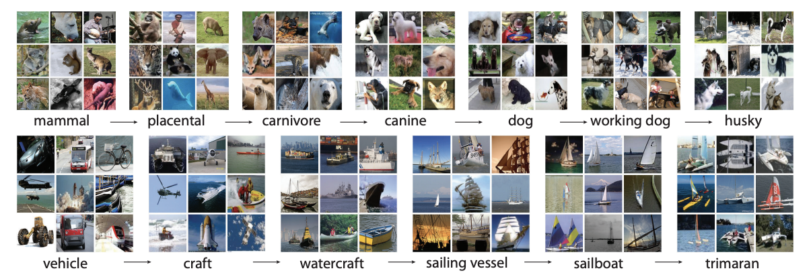

# ResNet-50 training from scratch on ImageNet1k (OneCycleLR + AMP) using AWS

This is a PyTorch implementation of training a ResNet-50 model **from scratch** on the **ImageNet-1k** dataset on an AWS EC2 instance, as part of *The School of AI – ERA-V4* course.

This repository trains ResNet-50 from scratch on **ImageNet-Mini** (for pipeline validation) and on **full ImageNet-1k**, using **OneCycleLR** and mixed precision (**AMP**):
- **Local**: single GPU (RTX 4060 Ti, 16 GB)
- **AWS**: spot instance **g5.xlarge** (NVIDIA A10G 24 GB)

Outputs include **TensorBoard** logs (local), **Weights & Biases** (AWS), plus structured **CSV** and **Markdown** training logs, model summary, and classification report.

---

## 1) Overview

**Task**  
- Dataset: **ImageNet-1k** (~1.28M train, 50k val, **1000** classes).  
- Train/val folder layout is standard `train/` and `val/` class-folders.

**Backbone**  
- **ResNet-50** from scratch (no pretrained weights).

**Optimization / Policy**  
- Optimizer: **SGD** (momentum, weight decay)  
- Schedule: **OneCycleLR** (per-batch) with `--max-lr` determined via LR-Finder  
- **Label smoothing**  
- Precision: **AMP** (fp16 autocast + GradScaler)

**Devices**  
- **Local**: RTX 4060 Ti (16 GB VRAM)  
- **AWS**: g5.xlarge (4 vCPU, 16 GiB RAM) with **NVIDIA A10G 24 GB**

**Monitoring**  
- **Local**: TensorBoard + CSV/Markdown logs  
- **AWS**: W&B (`imagenet1k_runs`) + CSV/Markdown logs

**Checkpoints (paths you can reuse)**
- **Local**  
  - `checkpoints\r50_imagenet1k_onecycle_amp_bs64_ep150\best.pth` → best validation (deploy/HF)  
  - `checkpoints\r50_imagenet1k_onecycle_amp_bs64_ep150\checkpoint.pth` → resume  
- **AWS**  
  - `/mnt/imagenet1k/checkpoints/imagenet1kfull_g5x_1gpu_dali_nvme_lr0p125_bs256_e150_work6/last_epoch.pth` → resume  
  - `/mnt/imagenet1k/checkpoints/imagenet1kfull_g5x_1gpu_dali_nvme_lr0p125_bs256_e150_work6/best_acc_epoch141.pth` → best validation (deploy/HF)

**TensorBoard (local)**  
```bash
tensorboard --logdir runs
```
Shows `train/loss`, `train/lr`, `train/top1`, etc., live.

**W&B (AWS)**  
- Project: `imagenet1k_runs`  
- Run name: `imagenet1kfull_g5x_1gpu_dali_nvme_lr0p125_bs256_e150_work6` (example)

> **Auto-filled results (from `out/<RUN>/train_log.csv`):**  
> Best Val Top-1: **77.82%** • Best Val Top-5: **93.82%** • Best Epoch: **228**

---

## 2) Quickstart

### 2.1 Clone & setup environment

```bash
git clone https://github.com/Sagar063/week9_ERAV4_ImageNet_ResNet-50_Model_Experiments.git
cd week9_ERAV4_ImageNet_ResNet-50_Model_Experiments
```

**Local (Windows)**
```powershell
python -m venv .venv
.\.venv\Scripts\Activate.ps1
pip install -r .
equirements.txt
```

**AWS**
1) **Mount your ImageNet EBS volume at `/mnt/imagenet1k`**
```bash
# See disks
lsblk -f

# Create mountpoint (idempotent)
sudo mkdir -p /mnt/imagenet1k

# Mount your 400-GB EBS volume (replace if your data disk isn't /dev/nvme1n1)
sudo mount -o defaults,noatime /dev/nvme1n1 /mnt/imagenet1k

# Give yourself ownership
sudo chown -R ubuntu:ubuntu /mnt/imagenet1k

# Verify
df -h /mnt/imagenet1k && ls -lah /mnt/imagenet1k
```

2) **(Ephemeral) NVMe workspace + virtual environment**
```bash
# The DLAMI ephemeral NVMe is typically at /opt/dlami/nvme
df -h /opt/dlami/nvme || sudo mkdir -p /opt/dlami/nvme

# Make a fresh venv (idempotent)
sudo mkdir -p /opt/dlami/nvme/envs
sudo chown -R ubuntu:ubuntu /opt/dlami/nvme
python3 -m venv /opt/dlami/nvme/envs/imagenet1k_venv

# Activate and install deps from your repo
source /opt/dlami/nvme/envs/imagenet1k_venv/bin/activate
cd ~/week9_ERAV4_ImageNet_ResNet-50_Model_Experiments
pip install --upgrade pip
pip install -r requirements_aws.txt
```

### 2.2 Train from scratch

**Download dataset (Mini for quick validation)**  
Kaggle URL: https://www.kaggle.com/datasets/ifigotin/imagenetmini-1000  
Place as:
```
data/imagenet-mini/
  ├─ train/
  └─ val/
```

**Run LR-Finder (recommended)**
```bash
python lr_finder.py find_lr --num_iter 100 --end_lr 1.0 --batch_size 64
```

**Run training (Local)**
```bash
python train_full_ImageNet1k_SingleGPU.py --name r50_onecycle_amp --epochs 20 --batch-size 64   --max-lr 0.1 --workers 8 --img-size 224 --reports
```

**Run training (AWS)**
```bash
tmux new -s imagenet1k_full -n train

# Inside tmux
source /opt/dlami/nvme/envs/imagenet1k_venv/bin/activate
cd ~/week9_ERAV4_ImageNet_ResNet-50_Model_Experiments

bash scripts/launch_single_gpu.sh /mnt/imagenet1k 150 256 6   --max-lr 0.125   --stats-file data_stats/imagenet_1k_aws_stats.json   --show-progress   --amp --channels-last   --out-dir imagenet1kfull_g5x_1gpu_dali_nvme_lr0p125_bs256_e150_work6   --wandb --wandb-project imagenet1k_runs   --wandb-tags imagenet1k_full,dali,1gpu,nvme,lr0p125,bs256,e150,work6
```

### 2.3 Resume from checkpoint

**Local**
```bash
python train_full_ImageNet1k_SingleGPU.py   --data-root data/imagenet   --batch-size 64   --epochs 235   --max-lr 0.0125   --pct-start 0.1   --workers 8   --reports   --use-best-for-reports   --name r50_imagenet1k_onecycle_amp_bs64_ep150   --resume
```

**AWS**
```bash
bash scripts/launch_single_gpu.sh /mnt/imagenet1k 150 256 6   --max-lr 0.125   --stats-file data_stats/imagenet_1k_aws_stats.json   --show-progress   --amp --channels-last   --resume /mnt/imagenet1k/checkpoints/imagenet1kfull_g5x_1gpu_dali_nvme_lr0p125_bs256_e150_work6/last_epoch120.pth   --out-dir imagenet1kfull_g5x_1gpu_dali_nvme_lr0p125_bs256_e150_work6   --wandb --wandb-project imagenet1k_runs   --wandb-tags imagenet1k_full,dali,1gpu,nvme,lr0p125,bs256,e150,work6,resumed_e120
```
### 2.4 Key arguments
| Arg | Default | Meaning |
|---|---:|---|
| `--data-root` | `data/imagenet-mini` | Root containing `train/` and `val/` (ImageFolder) |
| `--name` | `r50_onecycle_amp` | Run/experiment name used for all output folders |
| `--epochs` | `20` | Number of epochs |
| `--batch-size` | `64` | Global batch size (single-GPU) |
| `--workers` | `8` | DataLoader workers |
| `--img-size` | `224` | Input image size |
| `--max-lr` | `None` | Peak LR (if None, uses linear scaling rule `0.1 * (batch/256)`) |
| `--pct-start` | `0.3` | Fraction of steps for LR warm-up (OneCycleLR) |
| `--div-factor` | `25.0` | Initial LR = `max_lr/div_factor` |
| `--final-div-factor` | `1e4` | Final LR = `max_lr/final_div_factor` |
| `--no-amp` | `False` | Disable AMP if set |
| `--use-class-style-aug` | `False` | Alternate augmentation style |
| `--resume` | `False` | Resume from `checkpoints/<name>/checkpoint.pth` |
| `--reports` | `False` | Generate classification report & save curves |

### 2.5 Repository layout
```
week8_ERAV4_CIFAR_100_ResNetModel_Experiments/
├─ train.py
├─ model.py
├─ lr_finder.py
├─ dataset/
│ └─ imagenet_mini.py
├─ lr_finder_plots/                  # latest LR plot is embedded above
├─ runs/r50_onecycle_amp/            # TensorBoard event files
└─ out/
│   ├─ r50_onecycle_amp/
│      ├─ train_log.csv
│      ├─ logs.md
│      └─ out/
└─ reports/
│   ├─ r50_onecycle_amp/
│       ├─ accuracy_curve.png
│       ├─ classification_report.txt
│       └─ confusion_matrix.csv
│       ├─ loss_curve.png
│       └─ model_summary.txt
└─ images/
│   ├─ {imagenet_samples.png,resnet50_arch.png}  # OPTIONAL:  images
├─ update_readme.py
├─ README.md

```

---

## 3. About ImageNet

**ImageNet** is one of the most influential datasets in computer vision research.  
It contains over **14 million labeled images** organized into more than **22,000 categories**, and has become the foundation for evaluating and benchmarking deep neural networks for image classification and object recognition.

For this iteration, we use **ImageNet-Mini**, a curated **1,000-class subset (~4 GB)** derived from the ImageNet-1K dataset.  
It maintains the same structure and class diversity but is dramatically smaller, making it ideal for **rapid experimentation**, **debugging pipelines**, and **prototyping architectures** locally before scaling to full ImageNet-1K.

**Key Highlights:**
- 📚 **Standard Benchmark:** Widely used for assessing model accuracy and robustness.  
- ⚙️ **Lightweight & Scalable:** Enables faster iteration on consumer GPUs.  
- 🎯 **Diverse Classes:** Includes animals, vehicles, natural scenes, and household objects.  
- 🧩 **Transfer Learning Hub:** Models pretrained on ImageNet form the backbone of countless computer-vision systems.

### Sample Classes and Images

  
*ImageNet-Mini sample classes and images.*

---

## 4. About ResNet-50

**ResNet-50** (He et al., 2015) is a deep convolutional neural network consisting of **50 layers** built on the concept of *residual learning*.  
Residual connections (skip connections) allow gradients to flow more effectively through very deep networks, mitigating the **vanishing-gradient problem** and enabling the successful training of extremely deep CNNs.

**Key Features:**
- 🧩 **Residual Blocks:** Learn identity mappings that help deeper networks converge faster.  
- ⚙️ **Bottleneck Design:** Uses 1×1, 3×3, and 1×1 convolutions to balance accuracy and computation.  
- 🧠 **Depth:** 48 convolutional + 1 max-pool + 1 average-pool + 1 fully-connected layer (≈ 25.6 M parameters).  
- 🎯 **Input:** 224 × 224 × 3 images  **Output:** 1000 classes (ImageNet-1K).  
- 🚀 **Impact:** ResNet architectures revolutionized deep learning and remain a standard backbone for modern vision models.

### Architecture Diagram

  
*Residual Networks (ResNet-50) architecture.*

---

## 5) Learning Rate Finder (LR-Finder)

Before starting full training, we run a **Learning Rate Finder** to determine an optimal `--max-lr` for OneCycleLR. This reduces guesswork and stabilizes convergence.

**Why LR-Finder**
- 🚀 Eliminates guesswork (finds a good LR range)
- ⚖️ Improves efficiency (avoid suboptimal LRs)
- 📈 Optimizes OneCycleLR (use the discovered LR as `max_lr`)
- 💡 Reproducible (curve can be regenerated anytime)

**How it works**  
`lr_finder.py` performs a range test (`start_lr → end_lr` over N iterations), recording loss vs LR and saving a plot to `lr_finder_plots/`.

**Run (Local)**
```bash
python lr_finder.py find_lr --data-root data/imagenet --batch-size 64 --num-iter 1000
```

**Run (AWS)**
```bash
bash scripts/launch_lr_finder.sh /mnt/imagenet1k 256 2000 lr_finder_plots_imagenet1k_AWS
```

**Plot (AWS ImageNet-1k, iter=2000)**  
`lr_finder_plots_imagenet1k_AWS/lr_finder_20251031_203333_start1e-07_end1.0_iter2000.png`


**Interpretation**  
- Loss decreases smoothly up to **~0.10–0.12**, then trends upward.  
- We selected **`--max-lr 0.125`** for OneCycleLR on AWS (used in training commands above).  
- For local runs (smaller batch), a slightly lower `max_lr` (e.g., **0.1**) is reasonable.

> **Auto-filled (from runs):** For run **`r50_imagenet1k_onecycle_amp_bs64_ep150`**, best Val Top-1 = **77.82%**, Top-5 = **93.82%** at epoch **228**.

---
